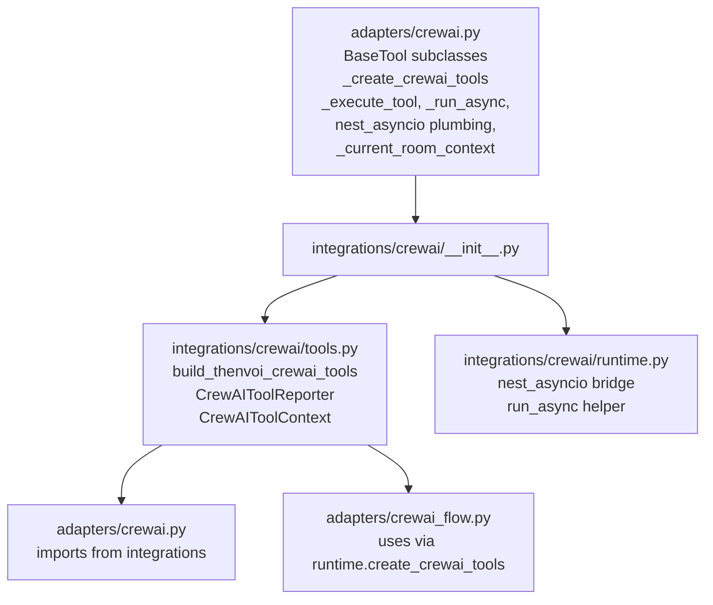
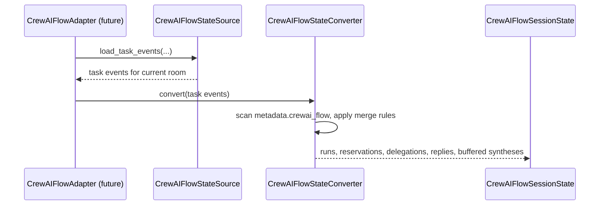
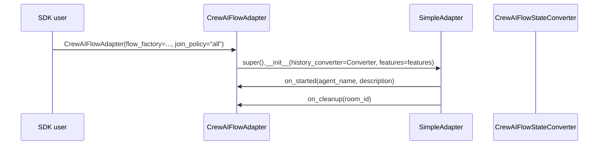
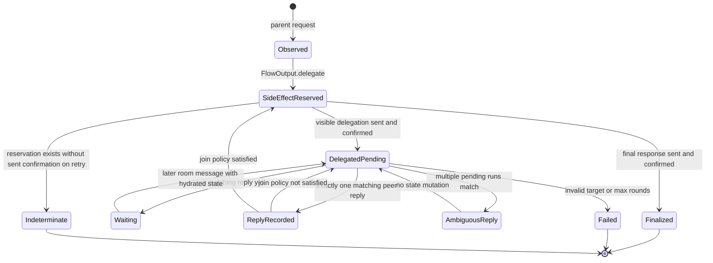
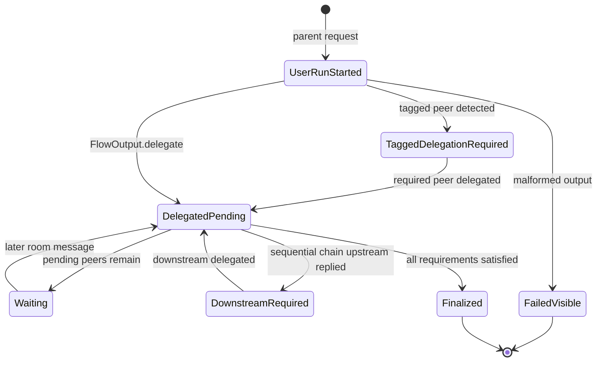
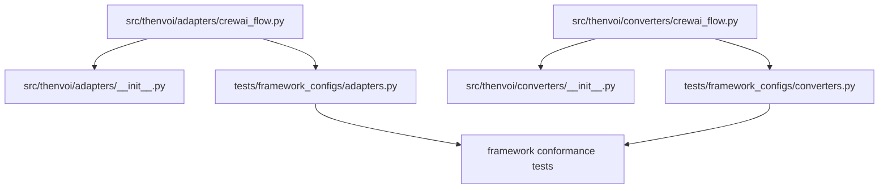
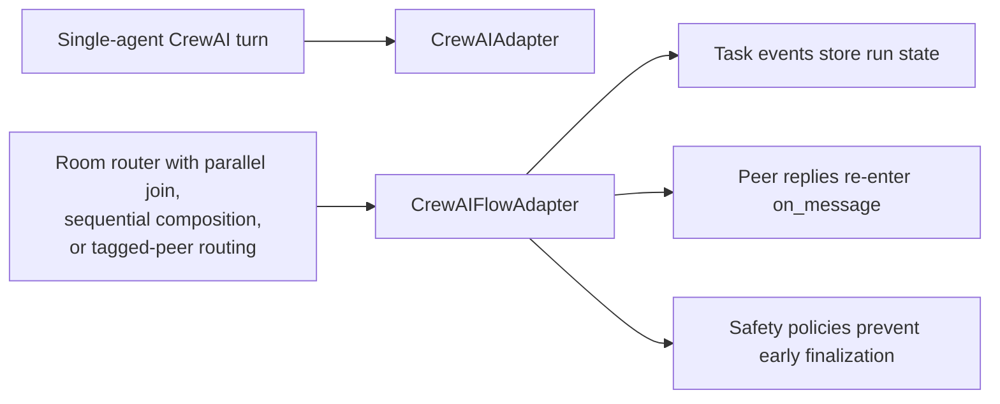
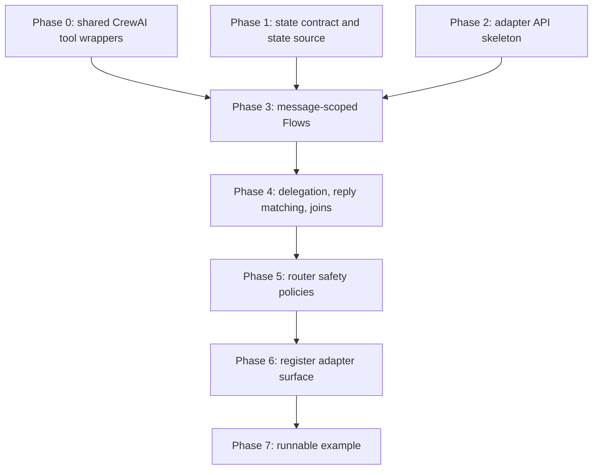

# [Adapters] CrewAI Flow Adapter

**Date:** 2026-04-27 | **Status:** Final

## Table of contents

1. [TL;DR](#tldr)
2. [Problem](#problem)
3. [High-level approach](#high-level-approach)
4. [Approaches considered](#approaches-considered)
5. [Canonical data shape](#canonical-data-shape)
6. [Public adapter API](#public-adapter-api)
7. [Flow input and output contract](#flow-input-and-output-contract)
8. [Reply matching and idempotency rules](#reply-matching-and-idempotency-rules)
9. [Router safety policies](#router-safety-policies)
10. [Phase 0: Extract shared CrewAI tool wrappers](#phase-0-extract-shared-crewai-tool-wrappers)
11. [Phase 1: Add the orchestration state contract and state source](#phase-1-add-the-orchestration-state-contract-and-state-source)
12. [Phase 2: Add the adapter API skeleton](#phase-2-add-the-adapter-api-skeleton)
13. [Phase 3: Execute message-scoped Flows](#phase-3-execute-message-scoped-flows)
14. [Phase 4: Add delegation, reply matching, and join handling](#phase-4-add-delegation-reply-matching-and-join-handling)
15. [Phase 5: Implement router safety policies](#phase-5-implement-router-safety-policies)
16. [Phase 6: Register the adapter surface](#phase-6-register-the-adapter-surface)
17. [Phase 7: Add the runnable example](#phase-7-add-the-runnable-example)
18. [Dependency graph](#dependency-graph)
19. [Test structure](#test-structure)
20. [Migration and deprecation plan](#migration-and-deprecation-plan)
21. [Security and privacy](#security-and-privacy)
22. [Observability](#observability)
23. [Resolved questions](#resolved-questions)
24. [Out of scope](#out-of-scope)
25. [Acceptance criteria](#acceptance-criteria)
26. [Appendix A: Background and prior art](#appendix-a-background-and-prior-art)
27. [Appendix B: Code-validated facts](#appendix-b-code-validated-facts)

## TL;DR

Add a new experimental `CrewAIFlowAdapter` for room-native multi-turn orchestration. The existing `CrewAIAdapter` stays as the default for simple agent turns. The new adapter runs one CrewAI Flow per inbound Thenvoi message, stores all orchestration state in Thenvoi task events, and reconstructs that state through a new `AgentToolsProtocol.fetch_room_context` method on every turn. It supports parallel fan-out with join, sequential composition, tagged-peer enforcement, and explicit waiting turns without relying on the model to track pending state from chat history. The adapter is deterministic on a single worker through reserve-send-confirm side effects with bounded retry on confirmation failures, and fails closed on ambiguous state. Runs that have not finalized within `max_run_age` (default 7 days) close proactively with `run_aged_out`. The implementation is eight phases (0–7) ending with public registration and one runnable example.

## Problem

The current `CrewAIAdapter` only exposes `crewai.Agent.kickoff_async(messages)` (`src/thenvoi/adapters/crewai.py:1284`). The model is given a flattened chat history and is expected to track every multi-turn invariant — which peers have been delegated to, which have replied, what stage the run is in, whether the final synthesis has been sent — by re-reading history each turn. This fails on two routing shapes:

```
Pat asks Router: "Prepare a presentation from the important emails I got today"
  -> Router delegates to Email-Reader
  -> Email-Reader replies later in the same room
  -> Router must delegate to Presenter next, using Email-Reader's reply
  -> Presenter replies later
  -> Router must send exactly one final synthesis to Pat

Expected: Router has a durable run with stage, delegated peers, pending peers,
peer results, and a finalization marker.
Actual: Router infers all of that from flattened chat history every turn and
gets it wrong as soon as the room has more than one open delegation.
```

The same failure appears in parallel fan-out:

```
Pat asks Router: "Summarize my open tickets and pending tasks for this week"
  -> Router delegates to Ticket-Bot and Task-Bot
  -> Ticket-Bot replies first
  -> Router must not send a partial final answer yet
  -> Task-Bot replies later
  -> Router sends one combined final answer

Expected: Router knows which delegated peers are still pending.
Actual: The model reconstructs the pending set from history and answers too early.
```

**The harm: any CrewAI router with parallel join or sequential composition has to either accept silent state loss, or write a runtime monkeypatch on `AgentTools` to track pending peers and buffer partial syntheses outside the SDK.**

### Current state

| Component | What exists | What's missing |
|---|---|---|
| `src/thenvoi/adapters/crewai.py` | One `CrewAIAgent`, room/tool binding via `ContextVar`, `Agent.kickoff_async(messages)` per turn | Explicit orchestration state for delegated peers, join policy, sequential stage, waiting state, finalization |
| `src/thenvoi/core/simple_adapter.py` | `on_event` converts `AgentInput.history` and awaits `on_message` directly (`:137`) | Adapter runner that suspends one invocation until future room events arrive |
| `src/thenvoi/preprocessing/default.py` | Loads room context only when `is_session_bootstrap=True` (`:80-86`) | Non-bootstrap peer replies never receive prior task events; Flow state needs an explicit state source |
| `src/thenvoi/core/protocols.py` | Adapters process messages only; lifecycle/presence events are filtered (`:194-220`) | Adapter-level subscription surface for arbitrary external waits |
| `src/thenvoi/runtime/tools.py` | `send_message(content, mentions)` (`:1194`); `send_event(content, message_type, metadata)` (`:1258`) | Chat messages cannot carry adapter correlation metadata; orchestration state must use task events |
| `src/thenvoi/converters/a2a.py` | Reconstructs A2A session state from task-event metadata | No CrewAI Flow equivalent that scans task events for orchestration state |
| `src/thenvoi/adapters/letta.py` | Emits task events with Letta session metadata for room reconstruction | No shared CrewAI Flow metadata envelope or converter |

CrewAI 1.14.3 exposes a usable Flow entry point: `Flow.__init__(persistence=None, tracing=None, **kwargs)` and `Flow.kickoff_async(inputs: dict[str, Any] | None) -> Any | FlowStreamingOutput`. The adapter calls `kickoff_async` once per inbound message. It does not rely on CrewAI persistence as the source of truth for room state, and tests assert the import path and signatures via `inspect.signature` rather than `crewai.__version__`.

## High-level approach

`CrewAIFlowAdapter` is a message-scoped orchestrator. Every inbound Thenvoi message creates one local Flow execution. That execution emits one terminal decision — answer, delegate, wait, synthesize, or fail — and the adapter converts that decision into Thenvoi side effects. The Python call returns. Later peer replies arrive as normal room messages and trigger another `on_message`, which loads prior task events from a state source, rebuilds `CrewAIFlowSessionState`, and runs another Flow. Task events are the only durable state.

```mermaid
sequenceDiagram
  participant Platform as Thenvoi platform
  participant Runtime as SimpleAdapter.on_event
  participant Adapter as CrewAIFlowAdapter.on_message
  participant Source as CrewAIFlowStateSource
  participant Converter as CrewAIFlowStateConverter
  participant Flow as CrewAI Flow
  participant Effects as SideEffectExecutor
  participant Tools as AgentTools

  Platform->>Runtime: message_created(parent request)
  Runtime->>Adapter: on_message(msg, tools, history)
  Adapter->>Source: load_task_events(room_id, namespace, tools, history)
  Source-->>Adapter: task-event history (server timestamp order)
  Adapter->>Converter: convert(task events)
  Converter-->>Adapter: CrewAIFlowSessionState
  Adapter->>Flow: kickoff_async(serializable input dict)
  alt visible decision (delegate / synthesize / direct_response)
    Adapter->>Effects: derive side_effect_key
    Effects->>Tools: send_event(task, status=*_reserved)
    Effects->>Tools: send_message(content, mentions)
    Effects->>Tools: send_event(task, status=*_sent, message_id)
  else waiting
    Adapter->>Tools: send_event(task, status=waiting)
  else failed or malformed
    Adapter->>Tools: send_event(error)
    Adapter->>Tools: send_event(task, status=failed)
  end
  Platform->>Runtime: message_created(peer reply, later turn)
  Runtime->>Adapter: on_message(reply, tools, history)
  Note over Adapter,Source: AgentInput.history is empty for non-bootstrap turns;<br/>state source must read from the platform.
  Adapter->>Source: load_task_events(...)
  Adapter->>Flow: kickoff_async(input with reconstructed state)
```

The hard rule is **message scope**. The Flow may decide that the run is waiting, but the adapter records that decision and returns. The adapter never blocks `on_message` waiting for a future event.

### Why a state source instead of `AgentInput.history`

`DefaultPreprocessor` populates `AgentInput.history` only when `is_session_bootstrap=True` (`src/thenvoi/preprocessing/default.py:80-86`). Every peer reply after session start arrives with an empty `HistoryProvider`. A history-only source would fail closed on every legitimate join — exactly the case this adapter exists for. The default `RestCrewAIFlowStateSource` calls `tools.fetch_room_context(room_id=..., page=..., page_size=...)` per turn (a new method on `AgentToolsProtocol` — see [Protocol additions](#protocol-additions)), filters task events by namespace, and orders by `(inserted_at, message_id)`. REST failure records `failed` with code `state_source_unavailable` and emits an error event — never silent empty state.

## Approaches considered

| Approach | Core idea | Determinism | SDK lifecycle fit | Main risk |
|---|---|---|---|---|
| Keep `CrewAIAdapter`, improve prompts | Track orchestration state via system prompt rules | Weak | Strong | Repeats history-inference failure; observed in real demo work |
| Replace `CrewAIAdapter` with Flow | Force every CrewAI use through Flow | Medium | Medium | Breaks the simple agent path |
| Long-lived Flow runner | Suspend Flow across external events | Strong | Weak today | Requires platform machinery this adapter does not own |
| **Message-scoped `CrewAIFlowAdapter`** (chosen) | Run Flow once per message; orchestration state in task events | Strong for one worker | Strong | Schema, reply matching, idempotency must all be precise |
| Framework-neutral orchestrator | Move routing/join into Thenvoi runtime; CrewAI is one executor | Strong | Medium | Larger product decision than this adapter |

The chosen path keeps `CrewAIAdapter` intact, preserves the existing adapter lifecycle, and moves router safety from runtime monkeypatches into typed state transitions.

## Canonical data shape

The `crewai_flow` task-event metadata is the v1 contract. Field names are stable for v1; any change requires a new `schema_version` and a loader that still reads version 1. The shape on the wire:

```json
{
  "crewai_flow": {
    "schema_version": 1,
    "room_id": "room-123",
    "run_id": "msg-parent-1",
    "parent_message_id": "msg-parent-1",
    "status": "observed | side_effect_reserved | delegated_pending | waiting | reply_recorded | reply_ambiguous | finalized | failed | indeterminate",
    "stage": "initial | delegated | waiting_for_replies | downstream_required | synthesizing | done | failed | indeterminate",
    "join_policy": "all | first",
    "text_only_behavior": "error_event | fallback_send",
    "delegations": [
      {
        "delegation_id": "msg-parent-1:email-reader",
        "target": {
          "participant_id": "agent-456",
          "handle": "@example/email-reader",
          "normalized_key": "email-reader"
        },
        "status": "reserved | pending | replied | ambiguous | failed | indeterminate",
        "side_effect_key": "msg-parent-1:delegate:email-reader",
        "reserved_event_id": "evt-reserve-1",
        "delegation_message_id": "msg-delegate-1",
        "sent_event_id": "evt-sent-1",
        "reply_message_id": "msg-reply-1"
      }
    ],
    "sequential_chains": [
      {
        "upstream_key": "email-reader",
        "downstream_key": "presenter",
        "status": "not_started | upstream_replied | downstream_delegated | complete"
      }
    ],
    "buffered_syntheses": [
      {"source_message_id": "msg-reply-1", "content": "partial final text"}
    ],
    "final_side_effect_key": "msg-parent-1:final",
    "final_reserved_event_id": "evt-final-reserve-1",
    "final_message_id": "msg-final-1",
    "final_sent_event_id": "evt-final-sent-1",
    "error": {"code": "malformed_flow_output", "message": "..."}
  }
}
```

### Pydantic model decomposition

Phase 1 creates these models. Each row maps the JSON path to its model and field type. All models are `pydantic.BaseModel` with `model_config = ConfigDict(extra="forbid")` and frozen field defaults.

| JSON path | Model | Field type |
|---|---|---|
| `crewai_flow` | `CrewAIFlowMetadata` | top-level envelope |
| `crewai_flow.schema_version` | `CrewAIFlowMetadata.schema_version` | `Literal[1]` |
| `crewai_flow.room_id` | `CrewAIFlowMetadata.room_id` | `str` |
| `crewai_flow.run_id` | `CrewAIFlowMetadata.run_id` | `str` |
| `crewai_flow.parent_message_id` | `CrewAIFlowMetadata.parent_message_id` | `str` |
| `crewai_flow.status` | `CrewAIFlowMetadata.status` | `CrewAIFlowRunStatus` (StrEnum) |
| `crewai_flow.stage` | `CrewAIFlowMetadata.stage` | `CrewAIFlowStage` (StrEnum) |
| `crewai_flow.join_policy` | `CrewAIFlowMetadata.join_policy` | `CrewAIFlowJoinPolicy` (StrEnum) |
| `crewai_flow.text_only_behavior` | `CrewAIFlowMetadata.text_only_behavior` | `CrewAIFlowTextOnlyBehavior` (StrEnum) |
| `crewai_flow.delegations[*]` | `CrewAIFlowDelegationState` | list element |
| `crewai_flow.delegations[*].target` | `CrewAIFlowParticipantSnapshot` | nested |
| `crewai_flow.sequential_chains[*]` | `CrewAIFlowSequentialChainState` | list element |
| `crewai_flow.buffered_syntheses[*]` | `CrewAIFlowBufferedSynthesis` | list element |
| `crewai_flow.final_*` | `CrewAIFlowMetadata.final_side_effect_key` etc. | flat fields on the envelope |
| `crewai_flow.error` | `CrewAIFlowError` | optional nested |

`CrewAIFlowSessionState` is the converter's output and aggregates one or more `CrewAIFlowMetadata` records keyed by `run_id`. It is not part of the wire format.

### Merge semantics

Task events accumulate; the converter scans them by the tuple key `(inserted_at, message_id)` ascending and applies merge rules per `run_id`. Platform `inserted_at` is `utc_datetime_usec` (microsecond precision per the `ChatMessage` schema), so same-timestamp collisions are rare but possible — `message_id` (the platform-monotonic event id) breaks ties. The platform itself uses the same `(inserted_at, id)` ordering pattern in deterministic-ordering code (e.g. chat-room title generation), so this matches the platform's own conventions.

- Scalar fields on the envelope (`status`, `stage`, `final_message_id`, `error`, etc.) — last write wins.
- `delegations`, `sequential_chains`, `buffered_syntheses` — merge by their stable key (`delegation_id`, `(upstream_key, downstream_key)`, `source_message_id`).
- Terminal absorbing states — once `status` is `finalized`, `failed`, or `indeterminate`, later events that would move the run back to a non-terminal state are ignored. The converter records a warning instead of mutating state.
- Performance: terminal runs short-circuit. The converter scans events for terminal runs to verify absorption (and to populate the warning log) but does not re-apply merges. For a room with R total runs of which T are terminal, per-turn merge cost is bounded by the active-run set, not the total event count.
- Bootstrap chat history is supplemental context only and is never the source of orchestration truth.

If a non-terminal run's `parent_message_id` timestamp is older than `now - max_run_age`, the converter records a synthetic `failed` task event with code `run_aged_out` for that run before returning state. The aged-out closure is reflected in `CrewAIFlowSessionState`; the next turn's reply matching treats it as terminal.

### Participant-key normalization

`CrewAIFlowParticipantSnapshot.normalized_key` is computed by a single deterministic algorithm. Same algorithm is used for delegation targets, reply senders, and tagged-peer enforcement — so all three resolve to the same key for the same participant.

```
normalize_participant_key(raw: str) -> str:
  1. Strip leading '@' if present.
  2. If '/' in remainder, take the segment after the LAST '/'.
  3. Lowercase.
  4. Strip leading and trailing whitespace.

  Then, given the room participant snapshot:
  5. If raw matches a participant.id (UUID match, exact),
     return normalize_participant_key(participant.handle).
  6. Otherwise return the result of steps 1-4 as the normalized key.
```

If two distinct participants in the room produce the same normalized key, the snapshot raises `CrewAIFlowAmbiguousIdentityError` and the adapter records `reply_ambiguous` for any sender that resolves through that key, without mutating delegation state.

### State source contract

`CrewAIFlowStateSource` is the only object allowed to hydrate orchestration state. Two implementations ship in v1:

| Implementation | Reads from | Default? | Use |
|---|---|---|---|
| `RestCrewAIFlowStateSource` | `tools.fetch_room_context(...)` per turn (with caching) | yes | production |
| `HistoryCrewAIFlowStateSource` | `AgentInput.history` (raw); requires `acknowledge_test_only=True` | no — explicit opt-in | tests, bootstrap-only deployments |

Both expose:

```python
async def load_task_events(
    *,
    room_id: str,
    metadata_namespace: str,
    tools: AgentToolsProtocol,
    history: HistoryProvider,
) -> list[dict[str, Any]]: ...
```

The state source consumes `tools.fetch_room_context(room_id, page, page_size)` — a new method on `AgentToolsProtocol` (see [Protocol additions](#protocol-additions) below). It does not read `tools.rest` directly. This preserves the protocol's role as the seam where wrappers (audit, rate limiting, request signing, PII redaction) can mediate every platform call.

#### What the platform endpoint returns

The Thenvoi context endpoint (`GET /api/v1/agent/chats/{chat_id}/context`, exposed via Fern as `agent_api_context.get_agent_chat_context`) returns only messages **the agent sent** or **the agent was mentioned in**, paginated by `page` and `page_size` (max 100), ordered ascending by `inserted_at`. Messages from other senders that do not mention the agent are not returned. This filter is load-bearing for the design: the adapter's own task events are agent-sent and therefore in scope, while bystander chatter in the same room never touches the state-reconstruction path.

The endpoint does not currently support a `since` / cursor parameter; the spec assumes page-based fetching with cache-driven early termination.

#### Caching and read amplification

Naïve per-turn full fetch is O(M) per turn and O(N×M) over a room's life. The default source maintains a process-local LRU cache keyed by `(room_id, namespace)` whose value is the list of task events seen so far plus a high-water mark `latest_inserted_at_seen`. On each turn the source:

1. Cache miss → full pagination (loop pages until empty), populate cache, return.
2. Cache hit → page from page 1 with `page_size=100`, walk results until an item with `inserted_at <= latest_inserted_at_seen` is reached, append the new prefix to the cached list, advance `latest_inserted_at_seen`. Stop. This bounds the per-turn fetch to "at most one page beyond the new tail" in the steady state.
3. Cache size is bounded — default 32 rooms with LRU eviction — and is per-process, not distributed.

#### v1 SLO ceiling

The adapter is characterized for rooms with **up to 1,000 agent-relevant messages** (sent-by-agent + mentioning-the-agent combined) over the run window of a single user request. Beyond that, per-turn convert and merge cost grows linearly. Operators with longer-running rooms should set distinct `metadata_namespace` values per `agent_id` and treat the namespace as ephemeral — pruning is a future feature gated on a platform-level task-event endpoint.

#### Failure handling

If `fetch_room_context` fails (network error, transient 5xx, auth), the adapter records `failed` with error code `state_source_unavailable` and emits an error event. The source attempts a single retry with short backoff and otherwise fails the turn. It must never silently return `[]` on read failure — that would let the adapter re-delegate or finalize early.

### Task-event write requirements and confirmation retry

Reservation, pending, reply-recorded, finalized, failed, and indeterminate task events are required state transitions. If `tools.send_event(content=..., message_type="task", metadata={metadata_namespace: ...})` fails, the adapter applies bounded retry with backoff:

- **Confirmation event after a successful visible send** (step 5 of [Side-effect order](#side-effect-order-reserve-send-confirm)): retry up to 3 times across ~1 second total. Most step-5 failures are transient and the visible message has already gone out — the run must not be wedged by a single network blip on a follow-up event write. After 3 consecutive failures, the in-process result records `indeterminate` and the next turn's reconstruction sees a reservation without a sent record.
- **Reservation, waiting, failed, ambiguous events** (no preceding visible send): retry up to 2 times. After failure, the adapter stops the turn and emits a normal error event if possible. No further visible sends are attempted.

The only visible message allowed between required task events is the one covered by the immediately preceding reservation event.

### Protocol additions

This spec extends `AgentToolsProtocol` (`src/thenvoi/core/protocols.py:41`) with one new method:

```python
async def fetch_room_context(
    self,
    *,
    room_id: str,
    page: int = 1,
    page_size: int = 50,
) -> dict[str, Any]:
    """Fetch room context for state-reconstruction use cases.

    Returns the platform's agent-context payload: messages this agent sent
    or messages mentioning this agent, paginated, oldest first. Implementations
    route through the platform REST surface; wrappers (audit, rate limiting,
    PII redaction) intercept here. Response shape mirrors the platform:
    {"data": [<message dict>...], "meta": {"page", "page_size", "total_count", "total_pages"}}.
    """
```

Concrete `AgentTools` (`src/thenvoi/runtime/tools.py`) implements this as a call to `agent_api_context.get_agent_chat_context`. `FakeAgentTools` (`src/thenvoi/testing/fake_tools.py`) implements it returning a configurable fake response. Adding the method does not change the existing `AgentTools.rest` attribute — adapters with bespoke needs can still reach `tools.rest`, but the state source must not.

## Public adapter API

```python
CrewAIFlowAdapter(
    *,
    flow_factory: Callable[[], Flow],
    state_source: CrewAIFlowStateSource | None = None,  # defaults to RestCrewAIFlowStateSource()
    join_policy: Literal["all", "first"] = "all",
    metadata_namespace: str | None = None,  # defaults to f"crewai_flow:{agent_id}" at on_started time
    max_delegation_rounds: int = 4,
    max_run_age: timedelta = timedelta(days=7),
    text_only_behavior: Literal["error_event", "fallback_send"] = "error_event",
    tagged_peer_policy: Literal["require_delegation_before_final", "off"] = "require_delegation_before_final",
    sequential_chains: Mapping[str, str] | None = None,
    history_converter: CrewAIFlowStateConverter | None = None,
    features: AdapterFeatures | None = None,
)
```

The `metadata_namespace` default is `None` at construction; the adapter resolves it to `f"crewai_flow:{agent_id}"` in `on_started(agent_name, agent_description)`. Two `CrewAIFlowAdapter` instances bound to different agents in the same room therefore use distinct namespaces by default. An operator who wants a shared namespace across agents (rare) can pass an explicit string.

The `max_run_age` knob defaults to 7 days. On every turn, the converter checks each non-terminal run's `parent_message_id` timestamp against `now - max_run_age`. Older runs proactively close with `failed` and code `run_aged_out`, an error event is emitted with a brief explanation, and the run is treated as terminal for all subsequent reply-matching. This bound is independent of platform task-event retention; operators set it to whatever their deployment tolerates.

### Validation rules

| Field | Validation | Failure |
|---|---|---|
| `flow_factory` | callable; constructor does not call it. Runtime checks the returned object is a `crewai.flow.flow.Flow` instance. If `flow_factory()` raises during a turn, the adapter catches, records `failed` with code `flow_factory_error`, emits an error event, and returns | `ThenvoiConfigError` (config), `failed` task event (runtime) |
| `state_source` | object with awaitable `load_task_events(*, room_id, metadata_namespace, tools, history) -> list[dict[str, Any]]`. Default is `RestCrewAIFlowStateSource()` | `ThenvoiConfigError` |
| `join_policy` | exactly `"all"` or `"first"` | `ThenvoiConfigError` |
| `metadata_namespace` | non-empty string or `None`; resolves to `f"crewai_flow:{agent_id}"` in `on_started` if `None` | `ThenvoiConfigError` |
| `max_delegation_rounds` | integer in `[1, 20]`. One round = one `Flow.kickoff_async` call that returns a `delegate` decision (regardless of how many delegations the decision contains). Counter is per `run_id` | `ThenvoiConfigError` |
| `max_run_age` | `timedelta`; must be positive. Default 7 days. Runs whose `parent_message_id` timestamp is older than `now - max_run_age` close with `failed` / code `run_aged_out` | `ThenvoiConfigError` |
| `text_only_behavior` | exactly `"error_event"` or `"fallback_send"` | `ThenvoiConfigError` |
| `tagged_peer_policy` | exactly `"require_delegation_before_final"` or `"off"` | `ThenvoiConfigError` |
| `sequential_chains` | mapping of upstream selector to downstream selector. Selectors are strings resolved against the room participant snapshot at `on_message` time using `normalize_participant_key`. Construction-time validation only checks types — invalid handles surface as a runtime `failed` state with code `unknown_participant` | `ThenvoiConfigError` (types), `failed` task event (runtime) |

## Flow input and output contract

CrewAI exposes `Flow.kickoff_async(inputs: dict[str, Any] | None)`. CrewAI copies top-level input keys into `flow.state`, so every top-level value must be JSON-serializable. `AgentTools` and other transient SDK objects stay outside `inputs`; Flow code accesses them via `get_current_flow_runtime()`.

Input shape:

```json
{
  "room_id": "room-123",
  "message": {"id": "msg-1", "content": "...", "sender_id": "user-1", "sender_name": "Pat", "created_at": "2026-04-27T16:00:00Z"},
  "state": {"schema_version": 1, "runs": []},
  "agent": {"name": "Router", "description": "..."},
  "participants": [
    {"id": "agent-456", "handle": "@example/email-reader", "name": "Email-Reader", "type": "Agent", "normalized_key": "email-reader"}
  ],
  "participants_msg": "formatted participant update or null",
  "contacts_msg": "formatted contact update or null"
}
```

### Flow state lifetime

`flow.state` lives only for one `kickoff_async` call. CrewAI copies top-level input keys into `flow.state` at the start of the call and discards the instance when the call returns. Mutations a `@listen` method makes to `flow.state` mid-run are **scratch** — they do not persist across turns and they do not reach the adapter. The only piece of Flow state that survives is the terminal decision dictionary the Flow returns.

Flow authors should:

- Read durable orchestration state from `inputs["state"]` at the start of each turn.
- Treat any in-Flow `self.state` mutations as ephemeral — useful for cross-method coordination inside one turn, never durable.
- Express durable intent (delegate, synthesize, wait, fail) only through the terminal return dict.
- Never pass a `persistence` argument to `Flow.__init__`. The adapter's task-event log is the source of truth; CrewAI persistence would create a second source.

The decomposed Pydantic state in `inputs["state"]` is the same `CrewAIFlowSessionState` the converter produces. It is read-only in the Flow's view.

### Decision shape

The Flow must return exactly one decision dictionary per `kickoff_async` call. Any other return — `None`, multiple terminals, a streaming output, a non-dictionary, or a dictionary missing `decision` — is treated as malformed and routes through `text_only_behavior`.

The adapter validates Flow output against discriminated-union Pydantic models. The discriminator is the `decision` field.

| `decision` value | Required fields | Optional fields | Adapter behavior |
|---|---|---|---|
| `direct_response` | `content: str`, `mentions: list[str]` | — | reserve final, send one visible message, record `finalized` |
| `delegate` | `delegations: list[DelegateItem]` (≥1) | — | reserve one side_effect_key per item; send one visible delegation per confirmed reservation; record `delegated_pending` |
| `waiting` | `reason: str` | — | record `waiting`; no visible message |
| `synthesize` | `content: str`, `mentions: list[str]` | — | apply join-policy + safety checks; if satisfied, reserve final, send, record `finalized`; otherwise buffer |
| `failed` | `error: {code: str, message: str}` | — | emit error event; record `failed` |

Where `DelegateItem` is:

| Field | Type | Required | Notes |
|---|---|---|---|
| `delegation_id` | `str` | yes | Stable across retries; format `{run_id}:{normalized_target_key}` is recommended but not enforced |
| `target` | `str` | yes | Participant selector resolved through `normalize_participant_key` |
| `content` | `str` | yes | Visible message body sent to the target |
| `mentions` | `list[str]` | yes | Resolved against room participants by `AgentTools.send_message` |

### Malformed output handling

With `text_only_behavior="error_event"` (default), any malformed output records `failed` and emits an error event. With `"fallback_send"`, a string return value is sent to the original requester only when no delegation is currently pending for the run; otherwise the run records `failed` to avoid partial answers.

`FlowStreamingOutput` is rejected as unsupported in v1 — record `failed`, emit error event. Streaming may be revisited later but is not in scope here.

### Side-effect order (reserve-send-confirm)

Every visible message goes through this sequence, executed under a per-room async lock:

1. Acquire the per-room lock. The lock guards the **entire** load-decide-write critical section, not just the writes — state load, decision, reservation, visible send, and confirmation all happen inside one lock acquisition. This eliminates the load-then-lock race where two near-simultaneous turns could each load identical state and reserve for the same `run_id`.
2. Derive a deterministic `side_effect_key`. Delegation: `{run_id}:delegate:{delegation_id}`. Final: `{run_id}:final`. Sub-Crew (see [Sub-Crew side-effect ordering](#sub-crew-side-effect-ordering) below): `{run_id}:subcrew:{counter}`.
3. Check reconstructed state for the same key. If `*_sent`, suppress the duplicate. If `*_reserved` without a sent record, mark the run `indeterminate` and emit a task event instead of resending.
4. Write a reservation task event (`status=side_effect_reserved`).
5. Send the visible message through the adapter-owned `SideEffectExecutor`. Flow code never holds a reference to `AgentTools.send_message`.
6. Write a sent task event (`status=delegated_pending` or `status=finalized`) with the platform message id, applying the bounded retry policy from [Task-event write requirements](#task-event-write-requirements-and-confirmation-retry).
7. If step 6 still fails after retry, log an error event if possible and mark the in-memory result `indeterminate` for this process. The next turn's reconstruction sees a reservation without a sent record and stays `indeterminate`.

If the process crashes between steps 4 and 6, the next retry must record `indeterminate` and not resend. Distributed exactly-once delivery requires a platform idempotency key the SDK does not have today; this is documented in [Out of scope](#out-of-scope).

#### Why two events per visible side effect

The reserve-then-confirm pattern writes 2 task events per visible send (compared to the simpler "single event after the visible send"). The cost is real: a parallel fan-out with N peers and one final synthesis writes 2N+2 task events per run. This is justified only if the failure mode "visible send succeeded but confirm did not" actually happens.

It does. Two paths produce that exact state:

- The platform's `send_message` returns 2xx and the message id, then the network drops or the process is interrupted before the next `send_event` write completes. The visible message is durable on the platform; the SDK's record of it is not.
- The platform processes `send_message` server-side but the response times out at the SDK boundary. Same outcome.

A single-event design ("write the task event after the visible send completes") cannot distinguish "visible send failed entirely" from "visible send succeeded but confirm event failed." The reservation captures intent before the irreversible step; the confirmation captures completion. On retry the converter sees both possibilities and decides safely. Without the reservation, a retry of an interrupted turn either silently double-sends or silently drops state — both are worse than the 2× event cost.

The cost is bounded: with the LRU cache and steady-state early-termination on the state source, per-turn read cost is bounded by new events only, not total room history.

## Reply matching and idempotency rules

Reply matching is deterministic against reconstructed state. For each inbound non-self message:

1. Build the candidate set from pending delegations in the active room only. A candidate is pending when its run is non-terminal and its delegation status is `pending` or `reserved` with no sent confirmation.
2. If the inbound message id equals a recorded `delegation_message_id`, ignore — that is the router's own delegation echoing back.
3. If the inbound message id equals a recorded `reply_message_id`, ignore — already processed.
4. Compute the inbound sender's normalized key via `normalize_participant_key`. If two participants in the room snapshot collide on that key, mark the sender ambiguous and skip state mutation.
5. If the message body contains a visible correlation token (see below), narrow candidates to the delegation whose `side_effect_key` matches. A mismatched token records `reply_ambiguous` rather than falling back.
6. If exactly one candidate matches the normalized sender (and the optional token), record it as that delegation's reply.
7. If multiple candidates match and no token disambiguates, record a `reply_ambiguous` warning task event and do not mutate any delegation state.
8. If no candidate matches and the inbound `sender_type` is `User`, treat the message as a new input. If no candidate matches and `sender_type` is `Agent`, the message is a stale or out-of-band peer reply (e.g. a peer that took longer than `max_run_age` to respond, or a reply to a finalized run); discard it with a debug-level log entry. Never start a new run on an Agent-typed sender that did not match any pending delegation.
9. If the run is in a terminal absorbing state (`finalized`, `failed`, `indeterminate`), never send another final message for that `run_id`.

### Correlation token format (v1)

When the same target has more than one pending delegation in the same room, the adapter prefixes the visible delegation content with a short token of the form `[ref:{token}]`, where `{token}` is the first eight hex characters of `sha256(side_effect_key)`. The peer is not required to echo it; if the peer's reply does contain the same `[ref:{token}]` substring, it disambiguates per rule 5. If the peer does not echo it and multiple pending delegations match the sender, the reply records `reply_ambiguous`. Single-pending-delegation-per-target is not affected.

The token is a **cooperative disambiguator, not a security control**. Both inputs to the hash (`run_id`, normalized target key) are observable to all room participants, so a participant can compute or guess any token. The threat model treats peer agents as cooperative — they were invited into the room. The fail-closed `reply_ambiguous` rule already neutralizes the worst-case spoofing path (a malicious peer cannot make the adapter mutate a delegation it did not match; it can at most force the adapter to mark a reply ambiguous, denying progress on that one delegation). Adapters that need adversarial-peer guarantees must extend this to a per-adapter HMAC secret in a future revision.

## Router safety policies

These are generic room-router invariants. They are framework-agnostic policy primitives, and they exist because every multi-agent room router has to enforce them or lose state.

| Invariant | Policy | Trigger |
|---|---|---|
| Do not answer before named delegates run | `tagged_peer_policy="require_delegation_before_final"` | If the inbound message text contains `@{handle}` for a peer in the room snapshot, finalization is blocked until that peer has a recorded delegation |
| Do not synthesize before required peers reply | `join_policy="all"` (default) or `"first"` | All pending delegations must have status `replied` (for `all`) or any one must (for `first`) before `synthesize` advances to `finalized` |
| Do not lose earlier peer replies | `buffered_syntheses` | A `synthesize` decision before the join is satisfied stores its content in `buffered_syntheses` for concatenation when the join completes |
| Sequential composition is required | `sequential_chains: Mapping[str, str]` | When the upstream key replies, finalization is blocked until the downstream key has a recorded delegation |
| Do not let identity formatting split state | `normalize_participant_key` (see [Participant-key normalization](#participant-key-normalization)) | All matches use the normalized key |
| Do not leave the user silent on malformed output | `text_only_behavior="error_event"` records failed and emits an error event; `"fallback_send"` sends a string return to the original requester when no delegation is pending | Configured at construction |

These primitives exist only on `CrewAIFlowAdapter` for v1. If other adapters need the same invariants, they should move into a framework-neutral orchestrator rather than growing more CrewAI-specific surface — that is explicitly [Out of scope](#out-of-scope) here.

## Phase 0: Extract shared CrewAI tool wrappers

**Goal:** Move the CrewAI `BaseTool` wrappers and the sync-to-async tool-execution plumbing out of `src/thenvoi/adapters/crewai.py` and into a new shared module, so both `CrewAIAdapter` and `CrewAIFlowAdapter` consume one set of wrappers and so Flow authors who spawn sub-Crews inside `@listen` methods get platform tools without copying code.

This phase exists because `CrewAIAdapter._create_crewai_tools()` is the single largest implementation in the file (~600 lines spanning `:489` to `:1161`) and it is currently bound to private adapter helpers (`_execute_tool`, `_report_tool_call`, `_report_tool_result`, `_serialize_success_result`) and to a module-level `ContextVar` (`_current_room_context` at `:54`). Without extraction, the Flow adapter either rebuilds the same wrappers (duplication) or reaches across `import thenvoi.adapters.crewai._private` (worse). Extraction also tightens the existing adapter — the wrappers move out, the adapter becomes a thinner agent-loop driver.



### Extraction layout

| New module | Contents | Replaces in `adapters/crewai.py` |
|---|---|---|
| `src/thenvoi/integrations/crewai/__init__.py` | Re-exports `build_thenvoi_crewai_tools`, `CrewAIToolReporter`, `CrewAIToolContext`, `run_async`. | — |
| `src/thenvoi/integrations/crewai/runtime.py` | `nest_asyncio` lazy patch + lock + `run_async(coro, fallback_loop)` helper. | `_ensure_nest_asyncio` (`adapters/crewai.py:61-78`), `_run_async` (`:81-110`), `_nest_asyncio_lock`, `_nest_asyncio_applied`. |
| `src/thenvoi/integrations/crewai/tools.py` | `CrewAIToolContext` dataclass (`room_id`, `tools: AgentToolsProtocol`); `CrewAIToolReporter` protocol (`report_call`, `report_result`); `build_thenvoi_crewai_tools(*, get_context, reporter, capabilities, custom_tools=None) -> list[BaseTool]`; all 18 `*Input` Pydantic models and 18 `*Tool` BaseTool subclasses currently inlined in `_create_crewai_tools`. | All `class *Input(BaseModel)` and `class *Tool(BaseTool)` from `:498-1116`, the body of `_create_crewai_tools` (`:489-1161`), and the custom-tool conversion logic at `:428-487`. |

### Decoupling the wrappers

The wrappers currently call into four adapter-private surfaces. Each is replaced by a public dependency injected at build time:

| Current coupling in `adapters/crewai.py` | New seam |
|---|---|
| `adapter._get_current_room_context()` reads module-level `_current_room_context` ContextVar (`:54`, `:298`) | `build_thenvoi_crewai_tools(get_context: Callable[[], CrewAIToolContext \| None], ...)`. The function passes back the room/tools snapshot. Each adapter owns its own ContextVar and supplies its own getter. |
| `adapter._report_tool_call`, `adapter._report_tool_result` (`:340-384`), gated by `Emit.EXECUTION in self.features.emit` | `CrewAIToolReporter` protocol with `async report_call(tools, name, input)` and `async report_result(tools, name, result, is_error)`. Two implementations ship: `EmitExecutionReporter` (current behavior, gated by `Emit.EXECUTION`) and `NoopReporter`. Each adapter passes whichever it wants. |
| `adapter._execute_tool(name, coro_factory)` (`:300-338`) | A small private `_execute_tool` helper inside `tools.py` that closes over `get_context`, `reporter`, and `run_async`. Same surface, no adapter reach-back. |
| `adapter._serialize_success_result(result)` (`:387-425`) | Module-level function in `tools.py`. Pure; no adapter state. |

`CrewAIToolContext` is small and frozen:

```python
@dataclass(frozen=True)
class CrewAIToolContext:
    room_id: str
    tools: AgentToolsProtocol
```

### Capabilities and custom tools

The current adapter selects which tool subset to expose based on `Capability.CONTACTS` and `Capability.MEMORY` (`adapters/crewai.py:1129-1149`). The new builder takes that selection as a parameter:

```python
def build_thenvoi_crewai_tools(
    *,
    get_context: Callable[[], CrewAIToolContext | None],
    reporter: CrewAIToolReporter,
    capabilities: frozenset[Capability],
    custom_tools: list[CustomToolDef] | None = None,
    fallback_loop: asyncio.AbstractEventLoop | None = None,
) -> list[BaseTool]: ...
```

Custom-tool conversion (`adapters/crewai.py:428-487` — the `CustomCrewAITool` factory) moves with the rest. The existing `CrewAIAdapter` signature does not change; it constructs the same set of tools by calling the builder with its own getter, reporter, and capabilities.

**Changes**

- `src/thenvoi/integrations/crewai/__init__.py` — new package init re-exporting the public surface.
- `src/thenvoi/integrations/crewai/runtime.py` — move `_ensure_nest_asyncio`, `_nest_asyncio_lock`, `_nest_asyncio_applied`, `_run_async` from `adapters/crewai.py:47-110`. Rename `_run_async` to `run_async` (public). Module docstring carries the existing process-global `nest_asyncio` warning verbatim.
- `src/thenvoi/integrations/crewai/tools.py` — move all `*Input` Pydantic models, all `*Tool` `BaseTool` subclasses, the custom-tool factory, and the `_execute_tool` helper into this module. Implement `CrewAIToolContext` and `CrewAIToolReporter` (protocol + `EmitExecutionReporter` + `NoopReporter`). Implement `build_thenvoi_crewai_tools` per the signature above.
- `src/thenvoi/adapters/crewai.py` — replace `_create_crewai_tools` with one call to `build_thenvoi_crewai_tools(get_context=self._get_context, reporter=EmitExecutionReporter(self.features), capabilities=self.features.capabilities, custom_tools=self._custom_tools, fallback_loop=self._tool_loop)`. Remove the now-extracted helpers (`_execute_tool`, `_report_tool_call`, `_report_tool_result`, `_serialize_success_result`, `_run_async`, `_ensure_nest_asyncio`, the module-level `nest_asyncio` lock). The module shrinks by ~700 lines.
- `src/thenvoi/adapters/crewai.py` — keep its own `_current_room_context` ContextVar (it is the legacy adapter's binding mechanism). The new helper `_get_context(self) -> CrewAIToolContext | None` reads that ContextVar and returns it as a `CrewAIToolContext`.
- **Pre-extraction audit step:** before deleting any code, run `rg "from thenvoi.adapters.crewai import _" --type py` and `rg "thenvoi.adapters.crewai\._" --type py` across the entire repo. Any matches are internal references to private names that must be rewritten to import from `thenvoi.integrations.crewai` after extraction. Document any audit findings in the PR description.
- `tests/adapters/test_crewai_adapter.py` — no changes required; behavioral tests cover the same surface and pass against the refactor. If any test reaches into `_create_crewai_tools` directly, update the import path to `thenvoi.integrations.crewai.tools.build_thenvoi_crewai_tools`.
- `tests/integrations/test_crewai_tools.py` — new file. Unit tests for `build_thenvoi_crewai_tools`: capability filtering selects the right tool list; `EmitExecutionReporter` only emits when `Emit.EXECUTION` is set; missing context returns the documented error JSON; custom tools are appended; `run_async` patches `nest_asyncio` lazily and only once across calls.
- `tests/adapters/test_crewai_adapter_soak.py` — new file, marked `@pytest.mark.slow`. Drives 100 sequential `on_message` calls across 3 simulated rooms with mocked CrewAI, asserts no exceptions, no event-loop policy mutations beyond the initial `nest_asyncio` patch, and that the per-room state in `_message_history` does not leak between rooms.

**Tests**

- Unit: `build_thenvoi_crewai_tools(capabilities=frozenset())` returns the seven base tools (no contacts, no memory).
- Unit: adding `Capability.CONTACTS` adds the five contact tools; adding `Capability.MEMORY` adds the five memory tools.
- Unit: `EmitExecutionReporter` with `Emit.EXECUTION` not in `features.emit` does not call `tools.send_event`.
- Unit: a tool invoked with `get_context()` returning `None` returns the documented `{"status": "error", "message": "No room context available..."}` JSON.
- Soak: 100 sequential turns across 3 rooms, no exceptions, no event-loop policy mutations after the first.
- Regression: every existing test in `tests/adapters/test_crewai_adapter.py` passes unchanged.
- Pass criterion: `uv run pytest tests/integrations/test_crewai_tools.py tests/adapters/test_crewai_adapter.py tests/adapters/test_crewai_adapter_soak.py -v`

## Phase 1: Add the orchestration state contract and state source

**Goal:** Add the versioned metadata models, converter, and state-source protocol that reconstruct CrewAI Flow state from task events on every inbound message.

This phase is purely additive and creates no adapter. It proves state reconstruction does not depend on bootstrap history.



**Changes**

- `src/thenvoi/converters/crewai_flow.py` — create the Pydantic models from the [decomposition table](#pydantic-model-decomposition): `CrewAIFlowMetadata`, `CrewAIFlowDelegationState`, `CrewAIFlowSequentialChainState`, `CrewAIFlowBufferedSynthesis`, `CrewAIFlowError`, `CrewAIFlowParticipantSnapshot`, plus the aggregate `CrewAIFlowSessionState`.
- `src/thenvoi/converters/crewai_flow.py` — create StrEnums `CrewAIFlowRunStatus`, `CrewAIFlowStage`, `CrewAIFlowDelegationStatus`, `CrewAIFlowJoinPolicy`, `CrewAIFlowTextOnlyBehavior`.
- `src/thenvoi/converters/crewai_flow.py` — implement `CrewAIFlowStateConverter.convert(raw)` applying the merge semantics from [Merge semantics](#merge-semantics), including terminal-state absorption.
- `src/thenvoi/converters/crewai_flow.py` — implement `normalize_participant_key` and `CrewAIFlowAmbiguousIdentityError`.
- `src/thenvoi/adapters/crewai_flow.py` — define the `CrewAIFlowStateSource` protocol with `async load_task_events(*, room_id, metadata_namespace, tools, history)`.
- `src/thenvoi/adapters/crewai_flow.py` — implement `RestCrewAIFlowStateSource`. Read items by paginating `tools.fetch_room_context(room_id=room_id, page=N, page_size=100)` (the new `AgentToolsProtocol` method from [Protocol additions](#protocol-additions)). Filter by `message_type == "task"` and presence of `metadata[metadata_namespace]`. Sort by `(inserted_at, message_id)` ascending. Maintain the LRU cache from [Caching and read amplification](#caching-and-read-amplification). On REST failure, retry once with backoff, then raise `ThenvoiToolError`.
- `src/thenvoi/adapters/crewai_flow.py` — implement `HistoryCrewAIFlowStateSource(*, acknowledge_test_only: bool)`. Constructor raises `ThenvoiConfigError` if `acknowledge_test_only` is not exactly `True`. On first non-bootstrap use (history empty), emits a single `WARNING`-level log: `"HistoryCrewAIFlowStateSource: AgentInput.history is empty on a non-bootstrap turn. State will be lost. If you see this in production, switch to RestCrewAIFlowStateSource."` Used only by tests and intentional bootstrap-only deployments; never the default.
- `src/thenvoi/runtime/tools.py` — add `AgentTools.fetch_room_context(*, room_id, page=1, page_size=50)` calling `self.rest.agent_api_context.get_agent_chat_context(chat_id=room_id, page=page, page_size=page_size)` and returning `{"data": [<message dict>...], "meta": {...}}`. Reuse the Fern-to-dict shim shape from `src/thenvoi/runtime/execution.py:551-567` (extract a small helper into `src/thenvoi/runtime/_context_serialization.py` and import from both `execution.py` and `tools.py`; do not duplicate).
- `src/thenvoi/core/protocols.py` — add `fetch_room_context` to `AgentToolsProtocol`.
- `src/thenvoi/testing/fake_tools.py` — implement `FakeAgentTools.fetch_room_context` returning a configurable list of message dicts. Constructor accepts `room_context: list[dict] | None = None`; if set, the method paginates over that list.
- `src/thenvoi/adapters/crewai_flow.py` — leave `CrewAIFlowAdapter` as a stub class for later phases so the test fixtures in this phase can import the state source without depending on Phase 2 work.
- `tests/converters/test_crewai_flow.py` — fixtures: empty history, unrelated task events, reservations, pending delegations, replies, ambiguous replies, buffered syntheses, finalized, failed, indeterminate, malformed metadata, duplicate normalized keys, REST read failure, non-bootstrap peer-reply replay, newest-event merge.
- `tests/converters/test_crewai_flow.py` — restart fixture that reconstructs state from raw task-event dicts without adapter memory.
- `tests/adapters/test_crewai_flow_state_source.py` — non-bootstrap peer-reply fixture where `AgentInput.history` is empty but `RestCrewAIFlowStateSource` returns prior task events from a `FakeAgentTools` whose `fetch_room_context` returns a preloaded list. Plus a fixture asserting cache early-termination behavior on a second turn.

**Tests**

- Unit: `tests/converters/test_crewai_flow.py` covers all v1 fields, reservation states, terminal absorption, merge rules, normalization.
- Unit: non-bootstrap replay uses `RestCrewAIFlowStateSource` with the fake REST client, never `AgentInput.history`.
- Unit: REST failure surfaces `ThenvoiToolError`, not silent empty state.
- Pass criterion: `uv run pytest tests/converters/test_crewai_flow.py tests/adapters/test_crewai_flow_state_source.py -v`

## Phase 2: Add the adapter API skeleton

**Goal:** Promote the Phase 1 stub into `CrewAIFlowAdapter` with the full constructor contract, validation, and SimpleAdapter lifecycle methods. No Flow execution yet.



**Changes**

- `src/thenvoi/adapters/crewai_flow.py` — import `Flow`, `start`, `listen`, `router`, `and_`, `or_` from `crewai.flow.flow` only where needed for typing or user re-export. Import behind a `try/except ImportError` block matching `src/thenvoi/adapters/crewai.py:22-32` so users without the `crewai` extra get a clear error.
- `src/thenvoi/adapters/crewai_flow.py` — implement `CrewAIFlowAdapter` extending `SimpleAdapter[CrewAIFlowSessionState]` with the constructor from [Public adapter API](#public-adapter-api). Constructor never calls `flow_factory()`. Constructor validation raises `ThenvoiConfigError` per the [Validation rules](#validation-rules) table.
- `src/thenvoi/adapters/crewai_flow.py` — implement `on_started` storing `agent_name` and `agent_description`. Do not invoke the Flow.
- `src/thenvoi/adapters/crewai_flow.py` — implement `on_cleanup(room_id)` that removes per-room async locks and transient caches scoped to that room only.
- `src/thenvoi/adapters/crewai_flow.py` — never call synchronous `Flow.kickoff()`. Use `kickoff_async` only.
- `tests/adapters/test_crewai_flow_adapter.py` — mock CrewAI modules using the `_get_crewai_adapter_cls` pattern from `tests/framework_configs/adapters.py:134-193`. Tests for constructor defaults, invalid config, `on_started`, `on_cleanup`.

**Tests**

- Unit: constructor validation, lifecycle behavior.
- Regression: `tests/adapters/test_crewai_adapter.py` still passes without modification.
- Pass criterion: `uv run pytest tests/adapters/test_crewai_flow_adapter.py tests/adapters/test_crewai_adapter.py -v -k "init or cleanup or started or validation or test_crewai"`

## Phase 3: Execute message-scoped Flows

**Goal:** Run one Flow per inbound message. Support `direct_response`, `waiting`, `failed`, and malformed output. Delegation is in Phase 4.

```mermaid
sequenceDiagram
  participant Runtime as SimpleAdapter.on_event
  participant Adapter as CrewAIFlowAdapter
  participant Source as CrewAIFlowStateSource
  participant Flow as CrewAI Flow
  participant Effects as SideEffectExecutor
  participant Tools as AgentTools

  Runtime->>Adapter: on_message(...)
  Adapter->>Source: load_task_events(...)
  Adapter->>Flow: kickoff_async(input dict)
  alt direct_response
    Adapter->>Effects: reserve final side_effect_key
    Effects->>Tools: send_message; send_event(task, finalized)
  else waiting
    Adapter->>Tools: send_event(task, waiting)
  else failed or malformed
    Adapter->>Tools: send_event(error); send_event(task, failed)
  end
```

### CrewAIFlowRuntimeTools API

Flow code reaches the runtime through a module-level `ContextVar` and the `get_current_flow_runtime()` helper. The exposed surface is **strictly read-only for platform side effects**: the Flow declares all room-visible side effects (delegate, synthesize, fail, wait) through its return dict, and the adapter is the only thing that calls `send_message` or `send_event`. The one exception is `create_crewai_tools()` — Flow authors who legitimately need to spawn a sub-`Crew` inside a `@listen` method (a normal CrewAI pattern) get a list of platform `BaseTool` instances they can pass to that Crew's agents. Those tools route through the same shared `build_thenvoi_crewai_tools` from Phase 0, so they enforce the same capability filtering and execution reporting as the legacy adapter.

| Member | Type | Purpose |
|---|---|---|
| `room_id` | `str` property | Current room |
| `agent_name` | `str` property | This agent's name |
| `agent_description` | `str` property | This agent's description |
| `participants` | `list[CrewAIFlowParticipantSnapshot]` property | Current room participants (snapshot, normalized keys precomputed) |
| `lookup_peers(page=1, page_size=50)` | `async` method | Discover peers available on the platform |
| `get_participants()` | `async` method | Refresh participant list from REST |
| `create_crewai_tools(*, capabilities=None, custom_tools=None)` | method | Returns `list[BaseTool]` for use inside a sub-`Crew` spawned by a `@listen` method. Defaults to the adapter's configured `features.capabilities` and `features.exclude_tools`/`include_tools` filtering. Tools enforce reserve-send-confirm: a sub-Crew agent calling `thenvoi_send_message` writes a reservation event, sends the visible message, and writes a sent event — same protocol as the adapter's own side effects. |

`CrewAIFlowRuntimeTools` does not expose `send_message`, `send_event`, `add_participant`, or `remove_participant` directly. Flow code that needs to delegate, synthesize, fail, or wait expresses that through the Flow's terminal return value. `create_crewai_tools()` is the only escape hatch, and the tools it returns route through the same adapter-owned `SideEffectExecutor` for visible writes.

#### Sub-Crew side-effect ordering

When a `@listen` method spawns a sub-`Crew` and that Crew's agent calls `thenvoi_send_message`, the call must go through the same reserve-send-confirm sequence as the adapter's own visible writes. The wiring uses a single concrete injection that the Phase 0 builder already supports:

The adapter constructs a `CrewAIFlowSubCrewReporter` (a `CrewAIToolReporter` subclass defined in `src/thenvoi/adapters/crewai_flow.py`, not in `integrations/crewai/`). The reporter holds a reference to the active `SideEffectExecutor` and to a per-run monotonically increasing counter scoped to `run_id`. When `runtime.create_crewai_tools()` is called, the adapter passes this reporter into `build_thenvoi_crewai_tools`. On every tool invocation the reporter:

1. Reads the active `run_id` from the Flow runtime `ContextVar` (the same one set during `kickoff_async`).
2. Increments the per-run counter and derives `side_effect_key = f"{run_id}:subcrew:{counter}"`.
3. Routes the visible send through the `SideEffectExecutor` with that key.
4. Writes reservation and confirmation task events under the adapter's namespace using the same merge rules as adapter-initiated sends.

`CrewAIToolReporter` from Phase 0 already gates execution-event emission via `report_call` / `report_result`. The new subclass overrides those hooks; Phase 0 gains no extra coupling. The Phase 0 builder remains framework-agnostic — it knows about `CrewAIToolReporter` but not about `SideEffectExecutor` or `run_id`.

From the converter's perspective, sub-Crew sends look like ordinary side effects whose key carries the `subcrew:` prefix and whose `delegation_id` is `None`; reply matching does not target them (rule 1 of [Reply matching and idempotency rules](#reply-matching-and-idempotency-rules) builds the candidate set only from `delegations[*]`, not from sub-Crew sends). A Flow that wants its sub-Crew output to participate in join/reply matching must instead express the call as a `delegate` decision in the return dict — sub-Crew side effects are explicitly **fire-and-forget** with respect to the orchestration state machine.

### Concurrency model

Per-room async locks guard the **entire** reserve-send-confirm critical section — state load, decision, reservation, visible send, and confirmation all happen inside one `asyncio.Lock` acquisition per `room_id`. The lock is local to the process, and `on_cleanup(room_id)` removes the lock entry.

Why locks at all, given that `SimpleAdapter.on_event` serializes turns per `ExecutionContext`? Two reasons:

1. The lock guards more than turns. A sub-Crew spawned inside a `@listen` method may issue multiple `thenvoi_send_message` calls concurrently (CrewAI's internal task scheduling). Each tool call hits the executor; the lock serializes them so the reservation/confirm pairs do not interleave.
2. Tests and integration paths can drive `on_message` directly outside the platform runtime. The lock encodes the invariant ("two visible sends for one `run_id` do not interleave") regardless of caller.

The adapter does not claim distributed exactly-once semantics (see [Out of scope](#out-of-scope)).

### ContextVar coexistence

`src/thenvoi/adapters/crewai.py` already defines `_current_room_context` (`:54-56`). `crewai_flow.py` uses a separate, independently named `ContextVar` — no shared module-level state, no cross-import. Both adapters can run in the same process without interfering.

**Changes**

- `src/thenvoi/adapters/crewai_flow.py` — define `CrewAIFlowRuntimeTools` per the [API table](#crewaiflowruntimetools-api) above. `create_crewai_tools(*, capabilities=None, custom_tools=None)` builds a `CrewAIFlowSubCrewReporter` (the `CrewAIToolReporter` subclass that bridges to `SideEffectExecutor`, see [Sub-Crew side-effect ordering](#sub-crew-side-effect-ordering)) and calls `thenvoi.integrations.crewai.tools.build_thenvoi_crewai_tools` from Phase 0 with that reporter, plus a context getter that returns the current Flow runtime's `CrewAIToolContext`.
- `src/thenvoi/adapters/crewai_flow.py` — define `CrewAIFlowSubCrewReporter`. It holds the active `SideEffectExecutor` reference and a per-`run_id` counter. `report_call(tools, name, input)` is the hook where the reporter intercepts `thenvoi_send_message` calls, derives the sub-Crew `side_effect_key`, and routes through the executor.
- `src/thenvoi/adapters/crewai_flow.py` — define a private module-level `ContextVar[CrewAIFlowRuntimeTools | None]` and the `get_current_flow_runtime()` helper.
- `src/thenvoi/adapters/crewai_flow.py` — implement the message processing pipeline: acquire per-room lock; load task events from `CrewAIFlowStateSource`; convert to `CrewAIFlowSessionState`; build the input dict from the message, state, participant snapshot, agent metadata, and participants/contacts messages; call `flow_factory()` once per turn (wrapped in try/except — any exception from `flow_factory()` records `failed` with code `flow_factory_error`, emits an error event, and returns); set the runtime `ContextVar` for the duration of `await flow.kickoff_async(inputs)`; clear the `ContextVar` in `finally`; release the lock.
- `src/thenvoi/adapters/crewai_flow.py` — define Pydantic discriminated-union models for the [Decision shape](#decision-shape). Validate Flow output against them before any side effect.
- `src/thenvoi/adapters/crewai_flow.py` — implement `direct_response`, `waiting`, `failed`, malformed-output handling using the reserve-send-confirm sequence. `FlowStreamingOutput` records `failed`.
- `src/thenvoi/adapters/crewai_flow.py` — define `SideEffectExecutor` as a private class. It is the only holder of a reference to `tools.send_message`. `CrewAIFlowRuntimeTools` does not import or wrap it.
- `src/thenvoi/adapters/crewai_flow.py` — per-room `asyncio.Lock` cache. On `on_cleanup(room_id)` the lock entry is removed.
- `tests/adapters/test_crewai_flow_adapter.py` — direct-response, waiting, failed, malformed-output, `FlowStreamingOutput` rejection, raw-tool-bypass rejection, duplicate-finalization, flow-factory-exception, event-bus-listener-bound, nest-asyncio-not-invoked, sub-Crew tool routing tests.

**Tests**

- Unit: mocked Flow returns `direct_response` → exactly one final reservation, one visible message, one finalized task event.
- Unit: mocked Flow returns `waiting` → no visible message, one waiting task event.
- Unit: mocked Flow returns malformed shape → error event + failed task event.
- Unit: mocked Flow returns `FlowStreamingOutput` → failed; no visible message.
- Unit: `flow_factory()` raises `RuntimeError("eager init failed")` → adapter records `failed` with code `flow_factory_error`, emits an error event, and `on_message` returns cleanly without propagating.
- Unit: 100 sequential `kickoff_async` cycles in the same process do not grow `crewai_event_bus`'s registered listener count beyond a small bounded set (assert listener count after 100 turns ≤ listener count after 10 turns + small constant).
- Unit: importing `CrewAIFlowAdapter` and running one `direct_response` turn does NOT invoke `nest_asyncio.apply` (verified by patching `nest_asyncio.apply` and asserting it is never called).
- Unit: `CrewAIFlowRuntimeTools` does not expose `send_message`, `send_event`, `add_participant`, or `remove_participant`. (Test introspects the public attribute set.)
- Unit: `runtime.create_crewai_tools()` returns a `list[BaseTool]` whose `thenvoi_send_message` invocations write a `subcrew:{counter}` reservation event, send through the `SideEffectExecutor`, and write a `subcrew:{counter}` confirmation event. Verified by patching the executor and asserting the side_effect_key format and the surrounding event sequence.
- Unit: a Flow that mutates `self.state` mid-`kickoff_async` and returns a decision dict — the next turn's reconstructed state ignores the `self.state` mutation entirely; only the persisted task events are reflected.
- Unit: same inbound message with already-finalized state does not send a second final response.
- Pass criterion: `uv run pytest tests/adapters/test_crewai_flow_adapter.py -v -k "direct or waiting or malformed or streaming or runtime_tools or idempotent or flow_factory or event_bus or nest_asyncio or subcrew or flow_state"`

## Phase 4: Add delegation, reply matching, and join handling

**Goal:** Support delegation across multiple room messages. Implement the [Reply matching and idempotency rules](#reply-matching-and-idempotency-rules) verbatim.



**Changes**

- `src/thenvoi/adapters/crewai_flow.py` — implement `delegate` handling: normalize each target via `normalize_participant_key`; reserve one `side_effect_key` per item; send one visible delegation message per confirmed reservation; record `delegated_pending`. When the same target has more than one pending delegation in the run, prepend the visible content with `[ref:{token}]` per the [Correlation token format](#correlation-token-format-v1).
- `src/thenvoi/adapters/crewai_flow.py` — implement reply matching exactly per the [rules](#reply-matching-and-idempotency-rules), including the `User`-vs-`Agent` sender filter on rule 8. A non-pending `Agent`-typed sender is discarded with a debug-level log; only `User`-typed senders can start a new run.
- `src/thenvoi/adapters/crewai_flow.py` — implement `join_policy="all"` and `join_policy="first"`.
- `src/thenvoi/adapters/crewai_flow.py` — implement `synthesize` handling with finalization checks and reserve-send-confirm.
- `src/thenvoi/adapters/crewai_flow.py` — implement `indeterminate` recording when a reservation exists without sent confirmation on retry, applying the bounded confirmation-retry policy from [Task-event write requirements](#task-event-write-requirements-and-confirmation-retry).
- `tests/adapters/test_crewai_flow_adapter.py` — single-delegation, multi-delegation, first-reply join, all-replies join, duplicate delegation, duplicate finalization, ambiguous-reply fail-closed, token mismatch fail-closed, duplicate normalized-key fail-closed, User-typed unmatched reply, Agent-typed unmatched reply, confirmation-retry success, confirmation-retry-exhausted indeterminate, sent-confirm failure indeterminate.

**Tests**

- Unit: initial request with two delegate items records two reservations followed by two pending delegations.
- Unit: one reply under `join_policy="all"` records replied state and does not synthesize.
- Unit: second reply under `join_policy="all"` reserves and sends exactly one final response.
- Unit: one reply under `join_policy="first"` reserves and sends exactly one final response.
- Unit: ambiguous reply records `reply_ambiguous` and does not advance pending state.
- Unit: a User-typed sender with no matching pending delegation starts a new run.
- Unit: an Agent-typed sender with no matching pending delegation is discarded; no new run is created and existing pending state is unchanged.
- Unit: a retry whose reconstructed state shows a reservation without sent confirmation records `indeterminate` and sends no visible message; the test asserts both `len(tools.messages_sent)` is unchanged and a new task event with `status=indeterminate` is present.
- Unit: confirmation `send_event` fails 2 times then succeeds — the run records `delegated_pending` (or `finalized`) on the third attempt; visible message is not re-sent.
- Unit: confirmation `send_event` fails 3 times — the in-process result records `indeterminate`; on the next turn, reconstructed state shows reservation without sent record and the indeterminate path is followed; visible message is not re-sent.
- Pass criterion: `uv run pytest tests/adapters/test_crewai_flow_adapter.py -v -k "delegation or join or reply_matching or reservation or indeterminate or sender_filter or confirmation_retry"`

## Phase 5: Implement router safety policies

**Goal:** Implement the [Router safety policies](#router-safety-policies) as typed state transitions on top of Phase 4.



**Changes**

- `src/thenvoi/adapters/crewai_flow.py` — implement `tagged_peer_policy="require_delegation_before_final"`. Detection: extract `@{handle}` tokens from the inbound message text, normalize each, intersect with the room participant snapshot. Block finalization until each detected handle has a recorded delegation.
- `src/thenvoi/adapters/crewai_flow.py` — implement `sequential_chains` selectors resolved against the structured participant snapshot at `on_message` time. When the upstream key replies, finalization is blocked until the downstream key has a recorded delegation.
- `src/thenvoi/adapters/crewai_flow.py` — implement `buffered_syntheses` for partial synthesis text produced before the join is satisfied; concatenate (in order of `source_message_id` arrival) when the join completes and the run finalizes.
- `src/thenvoi/adapters/crewai_flow.py` — implement `text_only_behavior` for malformed text-only output exactly per the [Malformed output handling](#malformed-output-handling) section.
- `tests/adapters/test_crewai_flow_adapter.py` — ordered-trace fixture for parallel fan-out: two delegations are reserved and sent, the first reply records replied state with no final visible message, the second reply triggers one final reservation and one final visible message.
- `tests/adapters/test_crewai_flow_adapter.py` — ordered-trace fixture for sequential composition: parent request, upstream delegation reservation, upstream visible delegation, waiting with no final, upstream reply via state-source replay, downstream delegation reservation, downstream visible delegation, downstream reply, one final reservation, one final visible message.
- `tests/adapters/test_crewai_flow_adapter.py` — **end-to-end fixture covering the full v1 user promise**: turn 1 parent request → two delegations reserved+sent (turn 1) → no final → turn 2 first peer reply → reply recorded, no final → turns 3-5 unrelated chatter (no state mutation) → turn 6 second peer reply → join satisfied → exactly one final reservation + visible message → turn 7 a duplicate of the original parent request from a different user message id is treated as a new run (separate `run_id`) → turn 8 a late reply from one of the original peers (after `finalized`) is discarded per rule 8 with no second final. Test asserts the exact ordered list of visible messages and task events matches a hand-written fixture file `tests/fixtures/crewai_flow_e2e_trace.json`.
- `tests/adapters/test_crewai_flow_adapter.py` — tagged-peer enforcement, event-only waiting, identity normalization, buffered synthesis, malformed text output, non-bootstrap replay tests.

**Tests**

- Unit: tagged peer cannot finalize before the tagged peer has a delegation event.
- Unit: under `sequential_chains={"upstream": "downstream"}`, an upstream reply blocks finalization until downstream has a delegation.
- Unit: parallel fan-out under `join_policy="all"` waits for both replies before finalizing.
- Unit: waiting decisions after delegation emit no visible message.
- Unit: UUID, namespaced handle, bare handle, and display-name forms all resolve to the same normalized key for the same participant.
- Unit: malformed text-only output records failed by default.
- Unit: ordered-trace fixtures for parallel and sequential scenarios match the expected visible-message and task-event sequence exactly.
- **Integration: the end-to-end ordered-trace fixture (`tests/fixtures/crewai_flow_e2e_trace.json`) — full multi-turn run covering parent request, two parallel delegations, two replies on different turns, one final synthesis, one duplicate-request that becomes a new run, and one stale peer reply that is discarded — matches the recorded fixture exactly.**
- Pass criterion: `uv run pytest tests/adapters/test_crewai_flow_adapter.py -v -k "safety or sequential or tagged or identity or ordered_trace or e2e_trace"`

## Phase 6: Register the adapter surface

**Goal:** Expose `CrewAIFlowAdapter` and `CrewAIFlowStateConverter` through the SDK lazy-import surfaces. Registration happens last so users cannot import a half-working orchestration adapter.



**Changes**

- `src/thenvoi/adapters/__init__.py` — add `CrewAIFlowAdapter` to `TYPE_CHECKING`, `__all__`, and `__getattr__`.
- `src/thenvoi/converters/__init__.py` — add `CrewAIFlowStateConverter` and `CrewAIFlowSessionState` to `TYPE_CHECKING`, `__all__`, and `__getattr__`.
- `tests/framework_configs/adapters.py` — add `_get_crewai_flow_adapter_cls`, `_crewai_flow_factory`, `_build_crewai_flow_config`. Append `_build_crewai_flow_config` to `_ADAPTER_CONFIG_BUILDERS`. Reuse the `_get_crewai_adapter_cls` mock pattern (`tests/framework_configs/adapters.py:134-193`); guard runtime methods (`on_message` and any flow-execution method) with the same `_CONFORMANCE_ONLY` pattern at lines 196-216.
- `tests/framework_configs/converters.py` — add `crewai_flow` to `CONVERTER_EXCLUDED_MODULES` (the precedent at lines 256-268 for `letta`, `codex`, `opencode`). The converter is metadata-only and does not implement the standard `convert() -> framework-format` contract that the harness validates. `test_config_drift.py::TestConverterConfigDrift` then passes.
- `pyproject.toml` — keep CrewAI Flow under the existing `crewai` and `dev` extras. CrewAI 1.14.3 is already pinned at `:69` and `:152`. No new extra.
- `tests/adapters/test_crewai_flow_adapter.py` — import-shape test: call `inspect.signature` on `crewai.flow.flow.Flow.__init__` and `Flow.kickoff_async` and assert parameter names (`persistence`, `tracing`, `**kwargs`; `inputs`). Do not assert on `crewai.__version__`.

**Tests**

- Unit: lazy imports work without importing real CrewAI until requested.
- Conformance: config drift passes; converter exclusion is explicit.
- Pass criterion: `uv run pytest tests/framework_conformance/test_config_drift.py tests/framework_conformance/test_adapter_conformance.py -v -k "crewai_flow or config_drift"`

## Phase 7: Add the runnable example

**Goal:** Add one runnable example that shows when to use `CrewAIFlowAdapter` versus the existing `CrewAIAdapter`.



**Changes**

- `examples/crewai/08_flow_router.py` — PEP 723 runnable example using `CrewAIFlowAdapter`, a toy Flow factory with two start methods (delegate and synthesize), `join_policy="all"`, and `sequential_chains={"data-fetcher": "presenter"}`. The example uses generic peer names (`data-fetcher`, `presenter`, `ticket-bot`, `task-bot`) and demonstrates direct response, parallel delegation, sequential handoff, waiting turn, and final synthesis.
- `examples/crewai/README.md` — add an "Adapter choice" section that names `CrewAIAdapter` for normal CrewAI agent turns (single-hop delegation, bounded one-peer synthesis) and `CrewAIFlowAdapter` for room-router orchestration (parallel join, sequential composition, tagged-peer routing).
- `src/thenvoi/adapters/crewai_flow.py` — module docstring states experimental status, v1 scope, the safety policies offered, the task-event state log, and that this adapter does not replace `CrewAIAdapter`.
- `tests/adapters/test_crewai_flow_adapter.py` — import-path and default-namespace test matching the example.

**Tests**

- Example syntax check: `uv run python -m py_compile examples/crewai/08_flow_router.py`.
- Unit: default `metadata_namespace` and import path match the example.
- Pass criterion: `uv run python -m py_compile examples/crewai/08_flow_router.py && uv run ruff check examples/crewai/08_flow_router.py examples/crewai/README.md src/thenvoi/adapters/crewai_flow.py src/thenvoi/converters/crewai_flow.py tests/adapters/test_crewai_flow_adapter.py tests/converters/test_crewai_flow.py`

## Dependency graph



P0, P1, and P2 are independent and can be built in parallel. P0 is a refactor of the existing `CrewAIAdapter` plus a new shared module; it has no dependency on Flow work. P1 is converter + state source + a stub adapter file; it has no dependency on the runtime tools. P2 fills the stub with constructor and lifecycle. P3 is the first phase that consumes all three: it imports `build_thenvoi_crewai_tools` from P0 to back `runtime.create_crewai_tools()`, the state source from P1, and the adapter shell from P2. P4 establishes orchestration behavior. P5 is the safety layer. P6 is registration only after the behavior is tested. P7 documents the final surface.

## Test structure

### Layers

- **Unit (converter)** — raw task-event dictionaries → typed `CrewAIFlowSessionState`. No mocked CrewAI, no fake tools.
- **Unit (state source)** — fake REST client returning fabricated `agent_api_context.get_agent_chat_context` responses; verifies non-bootstrap replay, REST-failure handling, namespace filtering, server-timestamp ordering.
- **Unit (adapter)** — mocked CrewAI modules, mocked Flow output, fake `CrewAIFlowStateSource`, failure-injecting `FlowFakeAgentTools`. Verifies reserve-send-confirm, local lock behavior, reply matching, safety policies.
- **Conformance** — construction, config drift, lifecycle, registry behavior. Adapter included; converter is in the explicit exclusion set.
- **Example** — `py_compile` and `ruff check`.

### Local verification

```sh
uv run pytest tests/converters/test_crewai_flow.py -v
uv run pytest tests/adapters/test_crewai_flow_state_source.py tests/adapters/test_crewai_flow_adapter.py -v
uv run pytest tests/framework_conformance/test_config_drift.py tests/framework_conformance/test_adapter_conformance.py -v -k "crewai_flow or config_drift"
uv run python -m py_compile examples/crewai/08_flow_router.py
uv run ruff check examples/crewai/08_flow_router.py examples/crewai/README.md src/thenvoi/adapters/crewai_flow.py src/thenvoi/converters/crewai_flow.py tests/adapters/test_crewai_flow_adapter.py tests/converters/test_crewai_flow.py
uv run pyrefly check
```

### CI additions

None. The current `dev` extra includes CrewAI; the adapter test suite verifies the Flow API by signature inspection.

### Test harness notes

`FlowFakeAgentTools` extends `FakeAgentTools` (`src/thenvoi/testing/fake_tools.py`) with:

- A `fetch_room_context` implementation backed by an in-memory list of message dicts. Tests preload this list with task events the adapter is expected to find on its next `load_task_events` call.
- A `fail_next_event` and `fail_next_message` switch for injecting send-side failures per call.
- An emitted-task-event tap that feeds back through `RestCrewAIFlowStateSource` so reservation-retry tests prove that on the retry turn the source returns the reservation without a sent record and the adapter records `indeterminate`.

Reservation-retry test pattern: configure `FlowFakeAgentTools` so the reservation `send_event` succeeds and the visible `send_message` throws. Run one turn. On the second turn, assert `len(tools.messages_sent)` is unchanged from the first failure point, assert a new task event with `status=indeterminate` is present, and assert no second visible message was attempted.

## Migration and deprecation plan

| Current pattern | Destination | Migration action |
|---|---|---|
| `CrewAIAdapter` for normal CrewAI agent turns | unchanged | none |
| Runtime monkeypatch on `AgentTools.send_message` for pending-peer tracking | `CrewAIFlowAdapter` safety policies + task-event state | move behavior into typed state transitions and tests |
| Existing CrewAI converter skips tool events | `CrewAIFlowStateConverter` scans task events under namespace | converters stay separate |

Version targets:

- Next minor release: `CrewAIFlowAdapter` ships as experimental and opt-in.
- A later minor release: drop the experimental marker once non-bootstrap state replay, reserve-send-confirm, reply matching, indeterminate handling, and the router safety policies are stable across user reports.
- No removal version planned for `CrewAIAdapter`.

## Security and privacy

The adapter enforces these boundaries:

- **Mention resolution** preserves the existing `AgentTools.send_message` trust boundary. The Flow adapter does not bypass participant lookup, mention validation, or room membership. If a Flow output names a target that cannot be resolved against the participant snapshot, the adapter records `failed` with code `unknown_participant` and emits an error event rather than guessing.
- **Task-event metadata size cap.** Each `crewai_flow` task-event payload is capped at 16 KiB serialized JSON. Writes that would exceed the cap are truncated with a marker field `_truncated: true` set on the metadata; the cap protects against runaway buffered_syntheses or pathological error blobs polluting the room's event log.
- **Peer-reply content does not appear in task events the adapter writes.** The adapter never copies a peer's reply body into metadata; reply tracking uses message ids and normalized keys only. Peer reply content stays in chat history, where the platform's existing access controls apply.

What the adapter cannot enforce: `buffered_syntheses[*].content` stores partial synthesis text that the user-supplied Flow itself produced. The Flow may have read peer replies, secrets, or PII as input and synthesized a string that includes them. The SDK does not redact user-Flow output. Operators concerned about partial-synthesis content review should:

- Avoid `synthesize` decisions that quote peer replies verbatim — summarize instead.
- Audit the Flow's content pipeline before deploying.
- Future: a `features.privacy_filter` callable applied to task-event content before write is on the roadmap; not in v1 scope.

## Observability

Task events are the user-visible progress log. Standard SDK logs are the diagnostic log.

Every state-transition log includes `room_id`, `run_id`, `status`, `stage`, `join_policy`, `delegation_id` (when present), `participant_key` (when present), and whether a visible side effect was sent or skipped. Logs do not include full message content, full Flow input, or API keys.

V1 adds debug-level logs for reply-matching decisions and warning-level logs for ambiguous replies, malformed Flow output, indeterminate reservation states, and duplicate side-effect suppression. Metrics are not in v1, but the log fields are stable enough to diagnose duplicate delegation, unmatched replies, indeterminate side effects, and early synthesis from logs alone.

## Resolved questions

| Question | Decision |
|---|---|
| Should Flow replace `CrewAIAdapter`? | No. Existing users need the simple agent path. |
| Should Flow wait across future peer replies inside `on_message`? | No. `SimpleAdapter.on_event` awaits `on_message`; v1 records waiting state and returns. |
| Where does durable orchestration state live? | Thenvoi task events. `send_event` supports metadata, and A2A/Letta already use task events for state reconstruction. |
| Can chat messages carry run metadata in v1? | No. `AgentTools.send_message` accepts content and mentions only. |
| Are local locks enough for exactly-once behavior? | No — they protect one process. v1 uses reserve-send-confirm and `indeterminate` to fail closed; distributed exactly-once needs platform support. |
| Should the existing CrewAI converter be reused? | No. It is optimized for LLM message input and skips orchestration state. |
| Does the installed CrewAI package expose the Flow API? | Yes. Verified by `inspect.signature` on `Flow.__init__(persistence=None, tracing=None, **kwargs)` and `kickoff_async(inputs)`. Tests assert these directly. |
| What happens to unmatched peer replies from a non-pending sender? | If `sender_type=User`, treated as a new input. If `sender_type=Agent`, discarded with a debug log — never starts a new run on a non-pending agent. |
| Default state source: history scan or REST per turn? | REST per turn, with an LRU cache that early-terminates on cached high-water mark to bound the steady-state read cost. History-only would fail closed because `DefaultPreprocessor` only hydrates history on bootstrap. |
| Does the platform `agent_api_context` endpoint support a `since` cursor? | No. Page-based pagination only (`page`, `page_size`, max 100 per page). The endpoint already filters server-side to messages the agent sent or was mentioned in. |
| What is the v1 SLO ceiling on room size? | 1,000 agent-relevant messages per active run window. Beyond that, per-turn cost grows linearly. |
| How does `tools.fetch_room_context` differ from accessing `tools.rest` directly? | `fetch_room_context` is a method on `AgentToolsProtocol` so wrappers (audit, rate limit, signing) intercept it. `tools.rest` is concrete-class only and bypasses wrappers. State source must use the protocol method. |
| Does `CrewAIFlowRuntimeTools` write? | No platform-state writes from Flow code directly. `create_crewai_tools()` is the only escape hatch and its tools route through `SideEffectExecutor` with reservation/confirmation events. |
| What is task-event retention on the Thenvoi platform? | Not formally specified. The adapter takes the conservative position: assume retention is bounded, default `max_run_age=timedelta(days=7)` proactively closes stale runs. Operators with longer retention can raise this. |
| Why two task events per visible side effect (reservation + confirmation)? | The reservation captures intent before the irreversible step; the confirmation captures completion. The pattern detects "visible send succeeded but confirmation event failed" — a real failure mode where a single-event design would either silently double-send on retry or silently lose state. The 2× write cost is justified by correctness. |
| What is the correlation token's threat model? | Cooperative disambiguator only. Peers are assumed invited and not adversarial. The fail-closed `reply_ambiguous` rule limits worst-case impact to denial-of-progress on the affected delegation, not state mutation. |

## Out of scope

- Replacing or deprecating `CrewAIAdapter`.
- Suspended Flow execution across external room events (a long-lived runner).
- Cross-room joins.
- Distributed locks or platform-level exactly-once delivery.
- Adding a `metadata` parameter to `AgentTools.send_message`.
- A framework-neutral orchestration runtime.
- Real API E2E tests requiring live LLM or Thenvoi credentials.

## Acceptance criteria

**Phase 0: shared CrewAI tool wrappers**

1. `src/thenvoi/integrations/crewai/tools.py` exports `build_thenvoi_crewai_tools`, `CrewAIToolContext`, `CrewAIToolReporter`, `EmitExecutionReporter`, and `NoopReporter`.
2. `src/thenvoi/integrations/crewai/runtime.py` exports `run_async` and the lazy `nest_asyncio` patch.
3. `src/thenvoi/adapters/crewai.py` no longer defines `*Input` Pydantic models, `*Tool` `BaseTool` subclasses, `_create_crewai_tools`, `_execute_tool`, `_report_tool_call`, `_report_tool_result`, `_serialize_success_result`, `_run_async`, or `_ensure_nest_asyncio`. The module shrinks accordingly. The legacy `_current_room_context` ContextVar stays.
4. `build_thenvoi_crewai_tools(get_context, reporter, capabilities=frozenset())` returns the seven base platform tools; adding `Capability.CONTACTS` adds five contact tools; adding `Capability.MEMORY` adds five memory tools.
5. `EmitExecutionReporter` only calls `tools.send_event` when `Emit.EXECUTION` is in the configured `emit` set; `NoopReporter` never calls it.
6. A tool invoked when `get_context()` returns `None` returns the documented error JSON (`{"status": "error", "message": "No room context available - tool called outside message handling"}`).
7. The pre-extraction audit (`rg "from thenvoi.adapters.crewai import _" --type py` and `rg "thenvoi.adapters.crewai\._" --type py`) reports zero internal references to extracted private names — or all references have been migrated to `thenvoi.integrations.crewai`.
8. The Phase 0 soak test (`tests/adapters/test_crewai_adapter_soak.py`) runs 100 sequential `on_message` calls across 3 rooms with mocked CrewAI, completes without exceptions, and asserts no event-loop policy mutation occurs after the first `nest_asyncio.apply` call.
9. Existing `tests/adapters/test_crewai_adapter.py` passes unchanged.
10. `uv run pytest tests/integrations/test_crewai_tools.py tests/adapters/test_crewai_adapter.py tests/adapters/test_crewai_adapter_soak.py -v` passes.

**Phase 1: state contract and state source**

11. `src/thenvoi/converters/crewai_flow.py` exports the v1 models, enums, `normalize_participant_key`, and `CrewAIFlowAmbiguousIdentityError` per the [decomposition table](#pydantic-model-decomposition).
12. `src/thenvoi/adapters/crewai_flow.py` defines `CrewAIFlowStateSource`, `RestCrewAIFlowStateSource` (default), and `HistoryCrewAIFlowStateSource(*, acknowledge_test_only)`.
13. `src/thenvoi/core/protocols.py` adds `fetch_room_context` to `AgentToolsProtocol`. `src/thenvoi/runtime/tools.py` implements it on `AgentTools`. `src/thenvoi/testing/fake_tools.py` implements it on `FakeAgentTools`. The Fern-to-dict shim is shared with `ExecutionContext.hydrate()` (no duplication).
14. `CrewAIFlowStateConverter.convert([])` returns an empty `CrewAIFlowSessionState`.
15. Task events without `metadata["crewai_flow"]` are ignored. Task events under a different `metadata_namespace` (e.g. another agent's `crewai_flow:other_agent`) are ignored.
16. v1 task events reconstruct `observed`, `side_effect_reserved`, `delegated_pending`, `waiting`, `reply_recorded`, `reply_ambiguous`, `finalized`, `failed`, and `indeterminate`.
17. Two task events with identical `inserted_at` apply in `message_id` order, regardless of REST response order.
18. Later events for the same `run_id` apply [merge semantics](#merge-semantics); `finalized`, `failed`, `indeterminate` are absorbing. Once a run is terminal, subsequent merge work is short-circuited (verified by performance test: 1,000-event log with 100 terminal runs is converted under a documented per-turn budget).
19. Malformed metadata produces a converter warning and a failed-state record without crashing conversion.
20. A non-bootstrap peer-reply test reconstructs pending state from `RestCrewAIFlowStateSource` (calling `tools.fetch_room_context`) while `AgentInput.history` is empty.
21. A non-bootstrap peer-reply test where `tools.fetch_room_context` raises records `failed` with `state_source_unavailable` and sends no visible message.
22. `RestCrewAIFlowStateSource` cache: on the second turn for the same room, only events with `inserted_at > latest_inserted_at_seen` are added. The cached prefix is reused. Verified by counting `tools.fetch_room_context` calls before and after.
23. `HistoryCrewAIFlowStateSource()` raises `ThenvoiConfigError`. `HistoryCrewAIFlowStateSource(acknowledge_test_only=True)` succeeds. First non-bootstrap use with empty history emits one WARNING-level log message.
24. A non-terminal run whose `parent_message_id` timestamp is older than `now - max_run_age` closes with `failed` / code `run_aged_out` on the next turn. The next reply for that run is matched by reply-matching rule 9 (terminal) — not as a new input.
25. Required task-event write failures (reservation, waiting, ambiguous) stop the turn after up to 2 retries; later visible sends are not attempted.
26. `uv run pytest tests/converters/test_crewai_flow.py tests/adapters/test_crewai_flow_state_source.py -v` passes.

**Phase 2: adapter API skeleton**

27. `CrewAIFlowAdapter` validates every constructor field per [validation rules](#validation-rules). Constructor never calls `flow_factory()`.
28. Invalid constructor values raise `ThenvoiConfigError`. `max_run_age=timedelta(0)` and `max_run_age=timedelta(seconds=-1)` both raise.
29. `state_source` validation rejects objects without an awaitable `load_task_events(*, room_id, metadata_namespace, tools, history)` method.
30. `metadata_namespace=None` resolves to `f"crewai_flow:{agent_id}"` in `on_started`. Two adapters with different `agent_id` values produce different default namespaces.
31. `on_started` stores agent metadata and does not call the Flow.
32. `on_cleanup(room_id)` removes locks and transient caches scoped to that room only.
33. `tests/adapters/test_crewai_adapter.py` continues to pass with no edits, verified by `uv run pytest tests/adapters/test_crewai_adapter.py -v`.
34. `uv run pytest tests/adapters/test_crewai_flow_adapter.py -v -k "init or cleanup or started or validation or namespace"` passes.

**Phase 3: message-scoped Flows**

35. A `direct_response` decision sends one visible message and records `status=finalized`.
36. A `waiting` decision sends no visible message and records `status=waiting`.
37. A `failed` decision emits an error event and records `status=failed`.
38. Malformed output with default `text_only_behavior="error_event"` emits an error event and records `status=failed`.
39. `FlowStreamingOutput` is rejected and records `status=failed`.
40. `flow_factory()` raising `RuntimeError` records `status=failed` with code `flow_factory_error`, emits an error event, and `on_message` returns cleanly without propagating.
41. Flow input contains only JSON-serializable state. `AgentTools` is reachable only through `get_current_flow_runtime()` during the active call.
42. A Flow that mutates `self.state` mid-`kickoff_async` and returns a decision dict — the next turn's reconstructed state ignores the `self.state` mutation entirely; only the persisted task events are reflected.
43. `CrewAIFlowRuntimeTools` does not expose `send_message`, `send_event`, `add_participant`, or `remove_participant` directly. Verified by introspecting the public attribute set against an allow-list. `create_crewai_tools()` is exposed.
44. `runtime.create_crewai_tools()` returns a `list[BaseTool]`. A sub-Crew tool invocation of `thenvoi_send_message` writes a reservation event with key `{run_id}:subcrew:{counter}`, sends through `SideEffectExecutor`, and writes a confirmation event with the same key. Verified by patching the executor.
45. 100 sequential `kickoff_async` cycles in the same process do not grow `crewai_event_bus`'s registered listener count beyond a small bounded set (assert listener count after 100 turns ≤ listener count after 10 turns + small constant).
46. Importing `CrewAIFlowAdapter` and running one `direct_response` turn does NOT invoke `nest_asyncio.apply` (verified by patching `nest_asyncio.apply` and asserting it is never called).
47. A retry whose reconstructed state already shows `status=finalized` for the same `run_id` sends no second final message.
48. `on_message` returns after one local `kickoff_async(inputs)` call.
49. `uv run pytest tests/adapters/test_crewai_flow_adapter.py -v -k "direct or waiting or malformed or streaming or runtime_tools or idempotent or flow_factory or event_bus or nest_asyncio or subcrew or flow_state"` passes.

**Phase 4: delegation, reply matching, joins**

50. A `delegate` decision sends exactly one visible delegation message per item.
51. Each delegation records `run_id`, `delegation_id`, `target.normalized_key`, and `status=pending`.
52. Retrying the same `run_id` and `delegation_id` after a recorded `delegation_message_id` does not send a duplicate.
53. A sender matching exactly one pending delegation records `status=replied` and `reply_message_id`.
54. A sender matching multiple pending runs records `reply_ambiguous` and does not mutate delegation state.
55. A non-pending `User`-type sender starts a new run.
56. A non-pending `Agent`-type sender is discarded (debug log) and does not start a new run or mutate state.
57. `join_policy="all"` finalizes only after every pending delegation has `status=replied`.
58. `join_policy="first"` finalizes after the first matching reply.
59. A retry whose reconstructed state shows a reservation without a sent record records `status=indeterminate`, sends no visible message, and the next turn observes `len(tools.messages_sent)` unchanged.
60. A confirmation `send_event` failure is retried up to 3 times with backoff. If all 3 retries fail, the in-process result records `indeterminate`; the visible message is not re-sent on the next turn.
61. After a sent-confirm task-event failure that exhausts retry, the next on-message turn observes a reservation without sent confirmation and records `status=indeterminate`; no second visible message is sent for the same `side_effect_key`.
62. Token mismatch and duplicate normalized-key tests record `reply_ambiguous` and send no visible message.
63. `uv run pytest tests/adapters/test_crewai_flow_adapter.py -v -k "delegation or join or reply_matching or reservation or indeterminate or sender_filter"` passes.

**Phase 5: router safety policies**

64. With `tagged_peer_policy="require_delegation_before_final"`, a tagged-peer request cannot finalize before the tagged peer has a delegation event.
65. With `sequential_chains={"upstream": "downstream"}`, an upstream reply blocks finalization until the downstream key has a delegation.
66. Parallel two-target fixtures finalize only after both replies under `join_policy="all"`.
67. Waiting decisions after delegation emit no visible message.
68. UUID, namespaced handle, bare handle, and display-name forms normalize to the same participant key when they refer to the same room participant.
69. Malformed text-only output records failed by default.
70. Ordered-trace fixtures for parallel and sequential scenarios match the expected visible-message and task-event sequence exactly. The adapter passes these fixtures without monkeypatching `AgentTools` or `CrewAIAdapter`.
71. **End-to-end ordered-trace fixture** covering the full v1 user promise — parent request → two parallel delegations → reply on turn 2 → wait turns 3–5 → reply on turn 6 → exactly one final synthesis → duplicate parent request on turn 7 starts a new run → late agent reply on turn 8 is discarded — matches `tests/fixtures/crewai_flow_e2e_trace.json` exactly.
72. `uv run pytest tests/adapters/test_crewai_flow_adapter.py -v -k "safety or sequential or tagged or identity or ordered_trace or e2e_trace"` passes.

**Phase 6: register the adapter surface**

73. `thenvoi.adapters.CrewAIFlowAdapter` lazy import works.
74. `thenvoi.converters.CrewAIFlowStateConverter` lazy import works.
75. `tests/framework_configs/adapters.py` includes `crewai_flow` with mocked CrewAI imports and `_CONFORMANCE_ONLY` runtime guards.
76. `crewai_flow` appears in `CONVERTER_EXCLUDED_MODULES` with a one-line reason comment matching the precedent for `letta`/`codex`/`opencode`. `tests/framework_conformance/test_config_drift.py::TestConverterConfigDrift::test_all_converter_modules_are_covered` and `test_no_stale_exclusions` both pass.
77. `pyproject.toml` keeps CrewAI Flow under the existing `crewai` and `dev` extras.
78. `uv run pytest tests/framework_conformance/test_config_drift.py tests/framework_conformance/test_adapter_conformance.py -v -k "crewai_flow or config_drift"` passes.

**Phase 7: runnable example**

79. `examples/crewai/08_flow_router.py` compiles with `uv run python -m py_compile examples/crewai/08_flow_router.py`.
80. `examples/crewai/08_flow_router.py` shows direct response, parallel delegation, sequential handoff, waiting state, and final synthesis using generic peer names.
81. `examples/crewai/README.md` adds an "Adapter choice" section that names `CrewAIAdapter` for normal agent turns and `CrewAIFlowAdapter` for room-router orchestration.
82. The example does not imply suspended Flow execution across future events.
83. PEP 723 metadata follows the project rules.
84. `uv run ruff check examples/crewai/08_flow_router.py examples/crewai/README.md src/thenvoi/adapters/crewai_flow.py src/thenvoi/converters/crewai_flow.py tests/adapters/test_crewai_flow_adapter.py tests/converters/test_crewai_flow.py` passes.

## Appendix A: Background and prior art

This adapter has prior art in two places. Both are private context for the design — neither appears in user-facing artifacts (examples, READMEs, public docstrings).

The parent multi-turn-orchestration problem was first surfaced through internal demo work where a CrewAI router needed to handle parallel fan-out and sequential composition over Thenvoi rooms. The demo team wrote a runtime monkeypatch on `AgentTools.send_message` and `AgentTools.send_event` to track pending peers, buffer partial syntheses, and reroute premature finalizations. That patch was effective but was not SDK-owned, was not reusable across users, and demonstrated by example that the existing `CrewAIAdapter` is the wrong abstraction for joins and waits. The acceptance criteria for the v1 ordered-trace fixtures (Phase 5) are derived from the behaviors that patch had to enforce.

The same internal review identified four candidate paths for the SDK fix: keep the current adapter and improve prompts; replace the adapter with Flow; build a long-lived Flow runner; build a message-scoped Flow adapter. The fourth path is what this spec implements. The state model — `user_request`, `delegated_peers`, `pending_peers`, `peer_results`, `stage`, `final_sent` — is the same as what the review proposed; it maps to `crewai_flow.parent_message_id`, `crewai_flow.delegations[]`, `crewai_flow.delegations[*]` filtered by status, `crewai_flow.delegations[*].reply_message_id` plus `buffered_syntheses`, `crewai_flow.stage`, and `crewai_flow.final_message_id` respectively.

The internal demo eventually shipped on a different adapter and a strong model with prompt-only routing, which works for that demo but does not solve the generic problem: any user who picks CrewAI for their router rediscovers the same monkeypatch surface. This adapter is the SDK-side answer.

## Appendix B: Code-validated facts

The spec's claims about the surrounding SDK, the Thenvoi platform, and CrewAI 1.14.3 were checked against source at the time of writing.

| Claim | Verified at |
|---|---|
| `Flow.__init__(persistence=None, tracing=None, **kwargs)` | `crewai.flow.flow.Flow.__init__` |
| `Flow.kickoff_async(inputs: dict[str, Any] | None) -> Any | FlowStreamingOutput` | `crewai.flow.flow.Flow.kickoff_async` |
| `start`, `listen`, `router`, `and_`, `or_` are exported | `crewai.flow.flow` |
| `SimpleAdapter.on_event` awaits `on_message` directly | `src/thenvoi/core/simple_adapter.py:137` |
| `AgentTools.send_message(content, mentions)` (no metadata kwarg) | `src/thenvoi/runtime/tools.py:1194` |
| `AgentTools.send_event(content, message_type, metadata)` | `src/thenvoi/runtime/tools.py:1258` |
| `AgentTools.rest` is the public REST attribute set by `from_context` | `src/thenvoi/runtime/tools.py:1160`, `:1189` |
| `DefaultPreprocessor` populates `AgentInput.history` only on session bootstrap | `src/thenvoi/preprocessing/default.py:80-86` |
| `ExecutionContext.hydrate()` uses `agent_api_context.get_agent_chat_context` | `src/thenvoi/runtime/execution.py:541-548` |
| Platform context endpoint `GET /api/v1/agent/chats/{chat_id}/context` accepts `page`, `page_size` (max 100); returns messages sent by or mentioning the agent only; ascending `inserted_at` order | `thenvoi-platform: lib/thenvoi_com_web/controllers/api/v1/agent/context_controller.ex:50-99` |
| Platform context endpoint has no `since` / cursor parameter | same file — only `page` and `page_size` are declared parameters |
| `Chat.get_agent_context` is the SQL-level filter for sent-by-agent or mentions-agent | `thenvoi-platform: lib/thenvoi_com/thenvoi/chat.ex:1706-1746` |
| `ChatMessage.inserted_at` is `utc_datetime_usec` (microsecond precision) | `thenvoi-platform: lib/thenvoi_com/thenvoi/chat/chat_message.ex:43,71` |
| Platform precedent for `(inserted_at, id)` deterministic ordering | `thenvoi-platform: lib/thenvoi_com/thenvoi/chat/chat_room_title_generator.ex:205` |
| Fern client surface: `agent_api_context.get_agent_chat_context(chat_id, page, page_size, request_options)` (sync + async) | `thenvoi_rest/agent_api_context/client.py:26-78` and `:98-158` |
| `ADAPTER_EXCLUDED_MODULES`, `CONVERTER_EXCLUDED_MODULES` exclusion sets exist | `tests/framework_configs/adapters.py:586-589`, `tests/framework_configs/converters.py:256-268` |
| `letta`, `codex`, `opencode` precedents for state-only converter exclusion | `tests/framework_configs/converters.py:256-268` |
| `_get_crewai_adapter_cls` mock pattern, `_CONFORMANCE_ONLY` runtime guard | `tests/framework_configs/adapters.py:134-216` |
| CrewAI 1.14.3 pinned in extras | `pyproject.toml:69`, `:152` |
